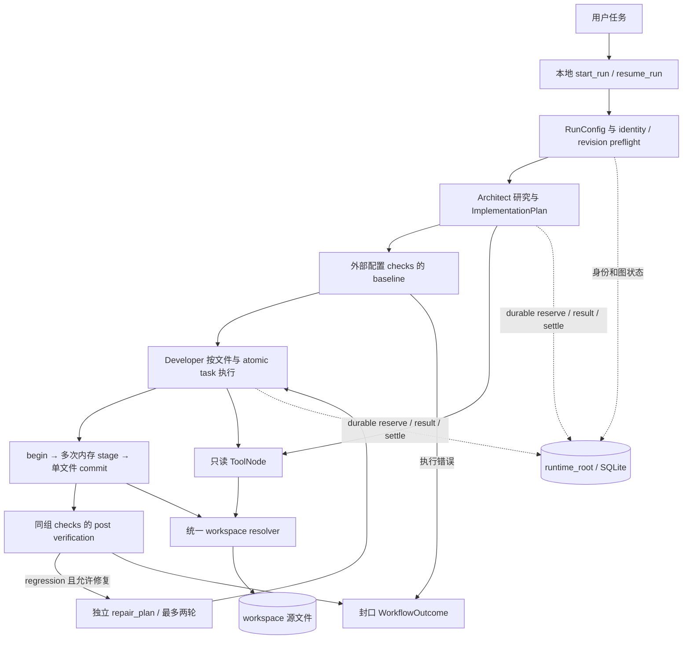

# SWE Agent 长期总优化方案（MASTER PLAN）

基线版本：1.0；核验日期：2026-09-16。

本文件是后续开发与独立审核的长期设计基线，回答“最终做成什么、保留什么、按什么顺序实现、凭什么验收”。日常完成情况与提交记录继续写入 [task_plan.md](task_plan.md)，核验过程写入 [notes.md](notes.md)。[历史架构调研](research/swe-agent-architecture-review.md)保留原貌，其中的早期现状不再代表当前实现。

最终目标：在明确支持的工作区、语言与运行环境中，保留 **LangGraph + Architect → Developer**，构建能够依据用户任务提出计划、可靠应用代码修改、运行可信验收、有限修复、记录执行证据并在可证明安全的条件下恢复的工程 Agent。成功必须由外部验收证据支持；不能以模型自评、计划遍历结束或程序退出代替。

治理规则：本文件规定长期目标与阶段边界；[AGENTS.md](AGENTS.md)规定工程执行约束，两者共同适用。阶段设计文档可以细化但不能静默放宽这里的契约。发现冲突时，先以实际源码/复现解释差异，提交小范围基线修订，再实施依赖该修订的功能。D 编号保持稳定，关闭问题保留证据，不因重新排序改号；新方向追加编号。改变成功语义、预算、恢复协议、支持平台或引入新依赖必须记录原因、兼容性、验收与回退。日常进度不反复改写本文件的历史核验事实。

## 1. 研究基线与结论边界

### 1.1 固定分析对象

- 当前项目 Git commit：`330f20f25426ce9b0ceb26ea926a11f6a8cb9d15`。本轮开始时工作区干净；本文件及过程记录是该提交之上的文档变更。后续复核使用 `git show <commit>:<path>`，不能把未来 HEAD 的行为归到本基线。
- 上游来源：`langtalks/swe-agent@5946af4f57cba03761015837ad5f87ef5c8d99e9`，见 [UPSTREAM.md](UPSTREAM.md)。它与 SWE-agent 官方同名项目不同。旧版本问题只能作为历史对照，不能直接列成当前缺陷。
- 核查范围：父图、两子图、运行依赖、计划与状态契约、workspace/editing、verification、runtime、模型装配、读取工具、提示词加载、现有测试、依赖声明和锁文件、S1/S2/S3 研究资料。没有对所有第三方依赖做安全审计。
- Windows / PowerShell 7；使用仓库 `.venv/Scripts/python.exe`。八项关键安装版本与锁文件一致：LangGraph 1.2.11、langgraph-checkpoint 4.2.0、langgraph-checkpoint-sqlite 3.1.1、langchain-core 1.6.2、langchain-anthropic 1.7.1、langchain-deepseek 1.1.0、tree-sitter 0.21.3、tree-sitter-languages 1.10.2。旧报告中的 LangGraph 0.6.3 与“SQLite 未安装”已不适用于当前基线。

### 1.2 证据等级

| 标记 | 含义 | 使用限制 |
|---|---|---|
| 源码确定 | 在上述 commit 的实际调用链、契约或依赖中确认 | 不代表每种环境和故障窗口都已执行 |
| 已复现验证 | 本轮执行现有测试，或执行第 8 节列明的隔离探针得到结果 | 必须说明 fake、真实本地进程、真实 SQLite 或真实模型的区别 |
| 待集成或待评测 | 影响合理但尚无本项目对应实验，或仅有单模块证据 | 不写成已出现的生产事故或已获得的收益 |
| 设计建议 | 尚未实现的模块、字段、状态、策略和阶段交付 | 进入路线前必须有验证方法；新增枚举名称也不代表现有 API |

外部项目证据单独标识 E1–E5，只证明参考机制存在，不提高本项目证据等级。研究文件中的既往模型 smoke 记录不等于本轮真实模型验证。

### 1.3 本轮执行与未执行

已执行：`python -m unittest discover -v` 共 157 项，**151 通过、6 跳过、0 失败**，耗时 20.370 秒；跳过原因是当前 Windows 账户无普通 symlink 创建权限，junction 用例实际通过。`python -m compileall -q agent helpers tests`、11 个 prompt 渲染、durable CLI `--help` 通过。测试覆盖 fake 模型图、真实本地验证命令、真实 SQLite 关闭重开、预算和若干调用崩溃窗口；不能统称真实模型端到端运行。

另执行五组无模型探针：事务净零修改、CLI 结果映射、失败日志指纹、多工具消息转写、非 Python grammar query，输入与观察见 §8.3。新增探针只用于核实本方案，尚未加入生产回归测试。

未执行：真实 provider 完整任务、真实模型恢复全链路、进程级写入 crash-window、全状态 secret canary、Linux/macOS 矩阵、SWE-bench、自建真实任务集 A/B。没有本项目成功率、成本下降或速度提升的结论。本轮没有实施方案中的业务修复，也没有升级依赖。

## 2. 当前真实架构

### 2.1 业务链与存储职责



图为主线示意：runtime error 另经父图失败封口；恢复从 checkpoint 的待执行节点继续，不重新从 Architect 开始。baseline 在 Architect 之后、首次 Developer 写入之前。工具研究循环在两子图内部；verification 由确定性代码直接调用，不是模型自由选择命令。

| 边界 | 当前真实职责与数据 | 不应承担的职责 |
|---|---|---|
| `agent/runtime/durable.py`、`__main__.py` | `start_run/resume_run`、本地同步 SQLite 生命周期、preflight、父图装配；CLI 将 task 放进 HumanMessage | 不负责代替 verification 判断需求是否解决 |
| `agent/architect/` | 提出/检查研究方向、ToolNode 调查、提取 `ImplementationPlan`；无效方向回到规划 | 不执行落盘、不提供真实验收裁决 |
| `agent/common/entities.py` | `READY/NO_CHANGES` 计划、文件任务与 atomic_tasks | atomic task 是计划粒度，不是文件系统事务 |
| `agent/developer/` | 校验计划、读取文件、研究、生成提案、调用编辑器；通过状态路由推进 | 不绕过 editor 直接覆盖文件；不自由扩展 repair 范围 |
| `agent/workspace/` | 配置根、ContextVar 运行作用域、相对路径和链接约束；读取工具可接受工作区内绝对路径，编辑拒绝绝对路径 | 不隔离命令的网络、环境变量或宿主机权限 |
| `agent/editing/` | `snapshot/apply/begin/stage/commit`；UTF-8、唯一匹配、基线 hash、单文件提交、结构化结果 | 不调用模型；不承诺跨文件事务、强并发 CAS 或 checkpoint 原子性 |
| `agent/verification/` | 可信 argv checks，workspace cwd、`shell=False`、命令超时、输出预览、baseline/post 分类、有限 repair | cwd 限制不是进程沙箱；输出内容是诊断数据，不是指令 |
| `agent/runtime/{budget,boundary,calls}.py` | 模型/ToolNode 调用预算；durable reservation、原始响应 usage 采集、结算；父子图共享预算 | ledger 不等于完整 trajectory，也不等于供应商账单 |
| `agent/runtime/{identity,semantics,revision,checkpointing}.py` | 路径身份、语义配置 digest、Agent revision、公开 checkpoint API、未知调用结果停止 | path identity 不证明同一路径目录内容未被替换 |
| SQLite checkpoint | 保存父/子图状态、事务 working copy、消息、预算、验证结果等可序列化值 | 当前没有统一全状态脱敏；不能当作只存安全元数据的事件日志 |

有两个入口，不能混称：正式本地 durable 入口是 `python -m agent.runtime start/resume`；`langgraph.json` 注册的 `agent.graph:swe_agent` 是保留的 Studio/dev 兼容入口，直接 compile、递归上限 200，没有本项目显式本地 saver 和 durable budget 保证。默认 runtime 已延迟创建模型；durable runtime 从配置显式构造 DeepSeek/Anthropic 客户端，旧“导入即绑定固定 Claude”的判断已过时。

### 2.2 应保留而非重复建设的能力

1. 保留父图编排和 Architect → Developer 分工；没有对照证据支持更换框架或新增 Reviewer/Manager Agent。
2. 保留编辑器公开 seam 与单文件 working copy。当前已解决旧行号漂移、原文不校验、隐式空计划、非法模型块仍推进、路径不统一等问题；D1 只补残余净零事务，不重写编辑器。
3. 保留 S2 baseline/post 与最多两轮同 Developer repair、独立 repair_plan、顶层终态封口。D2/D3 改进对外语义、证据精度和受控修复范围。
4. 保留 S3.1/S3.2 的小型不可变契约、配置注入、semantic digest、SQLite 公开 API、默认子图继承、`reserve → dispatch → settle`。继续补证据和恢复，不能重复新建另一套 runtime。
5. 保留当前两个实际 provider 和 fake 测试 seam；不建立通用 provider registry。新增配置必须纳入语义绑定并明确旧 checkpoint 行为。
6. 继续测试公开 editor、编译图事件、结构化结果和最终文件内容；用真实子进程/SQLite 验证基础设施，用真实任务衡量 Agent 效果。

## 3. 优化方向与问题核验

D1–D7 优先处理正确性、结果可信度与恢复边界；D8–D10 修复信息传递和检索契约；D11 的策略优化以 D12 数据为准。编号表达影响优先级，实际施工采用 §5 的依赖顺序，不能仅按编号连续开工。

### D1. 补齐编辑净零事务与残余文件边界

**已实现：** 源码确定、现有测试验证：唯一 SEARCH/REPLACE、task identity、哈希预检、拒绝不推进、同文件全部 stage 后一次 commit、UTF-8/CRLF/无末尾换行处理、拒绝 symlink/junction。见 L03、T01。单个提案未改变 working copy 会返回 NOOP。

**存在的问题：** 已复现验证 P5：原文件 A，依次 stage A→B、B→A，最终 `commit` 返回 APPLIED，before_hash=after_hash、diff 为空。`workspace.py:commit` 只检查是否有 task_ids，未判断最终内容是否回到原值，违反“没有修改不能当成功”的整体意图。源码确定：替换依靠临时文件、fsync、再次 hash 和 `os.replace`；没有跨进程锁，最终 hash 检查与 replace 之间仍存在窗口。不能把一般并发变更检查写成对抗性并发安全；窗口影响待故障注入。非 UTF-8、二进制、删除、重命名和跨文件原子性不在现有契约。

**外部已有机制：** E1 的唯一匹配/结构化错误，E3 的可读编辑反馈可参考；二者都不能证明本项目净零事务或并发文件保证成立。

**提出的新设计：** 保留 `WorkspaceEditor` interface。在确认当前磁盘仍符合 baseline 后、实际写入前判断已有文件最终 bytes 是否等于原始 bytes，返回 NOOP 和 task_ids，不改 mtime、不推进 Developer。冲突优先于 NOOP，不能用净零结果掩盖外部修改。新增空文件的“存在性变化”与已有空文件 NOOP 分开定义。编辑授权与并发限制由 D7 补齐，不引入模糊匹配、跨文件 fallback 或通用事务框架。

**验证 / A/B：** S1a 用公开接口 TDD：A→B→A、三步抵消、净零期间外部变更、同一内容不同换行、首次创建空文件、权限失败；检查状态、最终 bytes、mtime、diff、图下标。合法提交正确率和拒绝正确率按 §6 定义，所有确定性用例必须通过；无需模型 A/B。并发窗口测试归 S3.5a，不把未覆盖平台算通过。

### D2. 统一运行完成、业务终态和 CLI 结果

**已实现：** `WorkflowOutcome` 与 verification status 已分开；父图正常 END 前封口，rejected/NOOP/Developer failure 不会被父图判为完成。durable 有 `COMPLETED/PAUSED/REJECTED/FAILED`，表示运行生命周期。见 L01、L05、T02/T03。

**存在的问题：** 源码确定：`durable._run` 无 runtime_error 且 snapshot.next 为空时返回 runtime COMPLETED，即使 state.outcome 是 FAILED/UNVERIFIED。CLI 只输出该 status 并对 COMPLETED/PAUSED 返回 0，省略业务 outcome。P3 已用注入结果复现这个映射，未运行真实 provider。源码确定：`WorkflowOutcome.COMPLETED` 也可能对应 PRE_EXISTING_FAILURE 或部分 IMPROVED，不能等同全部 checks 通过。配置加载、目录创建、SQLite connect 等部分错误发生在现有 catch 外，结构化错误出口不完整；具体故障矩阵待补。

**外部已有机制：** E2 的退出状态/结果记录与 E5 的独立任务评分说明运行结束和任务解决可以分别表达；不直接复制其枚举。

**提出的新设计：** 增加小型、版本化对外结果摘要，至少包含 runtime_status、workflow_outcome、verification_status、error_code、run_id 和未来 record_ref。保留现有内部 lifecycle 语义；CLI 同时展示三种状态。设计退出码：0=按可信验收政策接受，1=正常结束但未通过/未验证，2=配置、基础设施或未知结果错误，3=暂停待继续；具体发布前用兼容测试固定。NO_CHANGES 只有任务外部 oracle 确认确实无需修改才可接受。D3 尚未落地时采用保守映射，不把 PRE_EXISTING_FAILURE 或 partial IMPROVED 自动列为解决。将入口可预期异常转为结构化结果，不捕获并吞掉中断；摘要先限制字段，再按 D6 完成统一 secret filtering。

**验证 / A/B：** S2b 枚举 lifecycle × outcome × verification 有效组合；分别测试 library 与 CLI 的真实 stdout JSON/exit code，覆盖 failed、unverified、no_changes、paused、unknown call、invalid config、SQLite 不可写、workspace 消失。保留父图 END 不泄漏 PENDING 的回归。成功误报数必须为 0；本项不用模型 A/B。

### D3. 验收证据稳定性、目标达成与多文件修复范围

**已实现：** baseline/post 使用同一组可信 argv/cwd checks；命令级 PASS/FAIL/TIMEOUT/EXECUTION_ERROR；新回归优先于 improvement；只有 regression 可修复且最多两轮；repair 重读并走 S1，保留 Architect 原计划。见 L04、T03。

**存在的问题：** P1 已复现：同一失败仅耗时文字变化，failure_id 不同而被判为 REGRESSION。原因是 failure_id 包含完整 stdout/stderr 的 digest，计时、临时路径、随机顺序均可能改变指纹；真实任务误判比例待测。反向也存在命令级证据不足：相同输出不证明失败测试集合相同。partial IMPROVED 允许仍有失败；外部 checks 没有区分需求目标与既有回归保护。`last_edit_result` 仅保留最后文件，repair_plan 只重放该文件；早先文件造成的错误未必能修，这是明确限制而非已定位事故。没有重复 patch/同错误提前停止契约。

**外部已有机制：** E5 按测试身份区分 FAIL_TO_PASS/PASS_TO_PASS；E3 提供失败块诊断和修复反馈。参考其机制，不让模型选择或放宽最终验收条件。

**提出的新设计：** 分两步。第一步保留通用命令结果，新增可信配置的最小测试报告解析器，起步只支持任务集实际使用的一种格式；输出 check_id、case_id、status、report_schema 和证据引用。时间等展示信息不进入 case identity，原始日志另存。不可解析时标明命令级/不足证据，不能猜测同一失败。增加受信任的 acceptance policy：目标检查必须通过，既有通过检查不得回归；允许保留的既有失败须在启动时明确，不能由模型临时决定。第二步在 D5/D6 后保存本轮 committed edits 清单与 repair intent：默认维持最后文件模式；只有可信策略允许时，修复范围才可扩大到已成功提交的原计划文件集合，仍逐文件事务、最多两轮、全局预算不重置。以 patch digest + 结构化 failure signature 检测停滞；没有归因证据就停止，绝不称“最后文件必然导致回归”。

**验证 / A/B：** S2c 对耗时/路径变化、失败集合增减、输出截断、缺失/畸形报告、部分 improvement、无检查、目标未通过写红测；误判回归率与错误接受率按 §6。S2d 用“首个文件故障、最后文件正常”、重复 patch、跨文件依赖、repair 范围越界和两轮上限集成测试；在 S5b 固定多文件任务比较最后文件策略与受控集合策略，报告解决率、额外调用/成本和新增回归。无法提升且增加成本则保留较小策略。

### D4. 把预算边界落实到实际调用与耗时

**已实现：** RunConfig 校验有限正值、output-token limit、价格来源；durable 调用前 reservation、raw usage 采集、结算；step 按模型调用/每个工具调用计数，批量工具全量准入；unknown usage 不伪装零成本；checkpoint 重开不重置 deadline/预算。见 L05、T04。

**存在的问题：** 源码确定：运行 deadline 在预算准入时检查，不中断已发出的模型请求；`build_chat_model` 未绑定 RunConfig timeout 或 SDK retries；verification checks 逐一使用自己的 timeout，没有与剩余运行时间取最小值。安装的 Anthropic adapter 有默认重试配置，但本项目未显式控制；一次逻辑 reservation 不能证明一次 HTTP 尝试或一次计费。末次调用可能越过成本阈值；当前双费率定价也不能精确代表缓存/分档计费。恢复后的 request_digest 只是部分输入身份摘要，未包含最终 prompt 全部内容，不能据此声称完整请求可回放。实际超时/重试/账单差异待集成验证。

**外部已有机制：** E2 调用前限额与调用后累计、超额后停止；它同样不提供绝对零超支。现有模型 adapter 的公开 timeout/retry 参数可用，不需要新模型框架。

**提出的新设计：** S3.2a 增加显式 model_request_timeout 与 retry policy，纳入 semantic digest。首版 durable 禁止隐藏自动重试；需要重试时每次尝试有独立预算身份，不对结果未知的请求自动重发。模型请求与每条 verification 取配置上限和剩余 deadline 的较小值；到期不再发起新副作用，使用有界清理时间，明确“deadline + 清理宽限”而非绝对瞬时终止。无法中断的 SDK 行为要返回限制或使用经验证的外层执行边界。区分逻辑调用、attempt、返回 usage 和估算费用；未知保持 unknown。完整请求摘要从最终渲染输入计算但不保存 raw secret；若无法完整覆盖就明确标为 partial identity。SDK 升级与价格模型扩展单独审查。

**验证 / A/B：** fake clock 验证边界，真实本地慢响应服务验证 SDK timeout、重试 attempt 数、迟到响应和断连，不用计时 sleep 桩冒充传输测试；真实命令验证多个 checks 的总时限。测试 N+1 拒绝、预算跨 repair/resume、不确定响应停止；记录 deadline 超限分布、实际尝试/逻辑调用比。计费精度需与 provider 返回 usage/账单对账后才能宣称，成本上限仍是准入阈值。

### D5. 文件写入、验证副作用与 checkpoint 恢复对账

**已实现：** 同步 SQLite、start/resume 身份与配置绑定、父子图传播、无 durable result 的 IN_FLIGHT 保守转 OUTCOME_UNKNOWN、不回退预算；已保存调用结果可只结算。文件写入已独立为 Developer commit node。见 L05、L03、T04。

**存在的问题：** 源码确定：没有 `pending_write`、write_intent 或 before/after hash reconciler。若 commit 已落盘但节点 state 未保存，恢复可能再次进入 commit，被基线 hash/已存在校验拒绝；当前不能自动认定上次已写成功，进度与文件不一致。具体进程级窗口待故障注入。verification 命令没有 durable attempt/result 边界，命令完成而 checkpoint 未保存时可能重跑；命令即使配置可信，也可能写缓存、生成文件或触发其他副作用。path-only identity 不能证明同一路径内容未被替换。

**外部已有机制：** E4 的同步持久化和公开 get_state/invoke(None) 支持图恢复，但不与文件或命令事务合并。借它的图状态生命周期，不额外实现 checkpoint 数据库，不承诺 exactly-once。

**提出的新设计：** 沿现有 S3.4 设计增加版本化 `WriteIntent(write_id, run/task identity, canonical path, before_hash, expected_after_hash, operation, task_ids)`。write_id 由持久化序号/repair attempt 生成，恢复不重新随机分配。先保存 intent，再 reconcile，随后沿现有 commit seam 写入；成功结果和进度持久化后清除 pending intent。当前 hash=after 时只补逻辑结果；=before 时允许 commit；第三值/非法路径/缺失冲突则停止，create 以“不存在”为 before。净零 edit 由 D1 先排除，避免 before=after 歧义。保留完整 lifecycle：进入下一文件清理旧 intent，repair 新建 intent，历史成功记录留给 D6。哈希相等只证明当前 bytes，不能证明从未被外部修改。

verification 独立增加 attempt_id、spec digest、输入 workspace snapshot 摘要、STARTED/RESULT_RECORDED。resume 有结果则复用已保存结果；仅有 STARTED 时默认 outcome_unknown 停止。只有启动时明确声明可重复且隔离环境可重建的 checks 才允许重跑，并记录新 attempt。这里是后续 S3.4b，不能随写入恢复一次全部加入。

**验证 / A/B：** S3.4a 使用真实 SQLite 与子进程退出，在 intent 前后、replace 后 state 前、state 后进度前、repair 中断逐个注入；覆盖 edit/create、重复 resume、第三方改动、目录被换成链接、多文件部分完成。按最终 bytes、写入事件/可观察副作用和 checkpoint 验收，不断言私有函数调用数。S3.4b 用实际命令产生测试计数标记，验证未知执行停止与声明可重复检查的重跑。恢复判定正确率、可恢复子集恢复率和重复副作用率分开报告；保守停止不算自动恢复成功。

### D6. 可审计轨迹、完整日志与全状态秘密处理

**已实现：** budget ledger 保存 usage、digest 和调用身份；配置 API key 使用 SecretStr，semantic digest 不包含密钥。runner 持续读取 stdout/stderr、保留有界头尾和全流 digest；failure_id 使用完整输出摘要。当前 canary 测试证明配置密钥没有沿该测试路径进入 SQLite/ledger。见 L04/L05、T04。

**存在的问题：** 没有 EventSink、ArtifactStore 或完整日志文件，截断中部无法从 digest 恢复。图 checkpoint 仍保存用户/模型/ToolMessage 内容、文件 working copy、diff、verification stdout/stderr；配置密钥安全不能推广到所有这些入口。现有 canary 不是全链路 secret 测试，不能声称“checkpoint 已全脱敏”。异常 message 也可能携带 payload。磁盘故障、事件重复/尾部损坏和记录缺失尚无统一失败语义。

**外部已有机制：** E2 持续保存 trajectory 和退出结果；E1 有历史外存/摘要的研究证据。借记录职责分离，不引入外部 telemetry 平台；外部保存失败策略不自动满足本项目要求。

**提出的新设计：** 分三个提交切片。先在**每次返回可持久化 state 之前**处理已知配置秘密：初始任务、模型输出、ToolNode 公开工具 adapter 输出、verification pipe、异常摘要；模型与配置留在进程内。若 secret 出现在待写源码/working copy，脱敏会改变文件语义，则结构化拒绝 SENSITIVE_DATA_DETECTED，不偷偷改源码再继续。只承诺已知 secret/明确规则的覆盖，不声称识别所有隐私。

其次增加小型 `EventSink.append_once(RunEvent)`：schema_version、run/task/step/call/write/verification identity、event_type、phase、status、摘要和 artifact refs；幂等键来自稳定身份，序号不是语义身份。最小本地实现即可；checkpoint 是恢复依据，event 是审计，不构成共同事务。遇到写失败/损坏不能把记录缺失当成功，停止或明确 audit_incomplete，默认不接受为可审计完成。

最后 runner 在 pipe drain 阶段同时产生脱敏 spool 和有界 preview，结束后原子发布 artifact；处理跨 chunk secret、磁盘额度和清理。`ArtifactRef` 包含路径、hash、bytes、kind、redacted/truncated；“完整日志”指除声明的脱敏外没有因 preview 截断丢失，磁盘额度耗尽必须标不完整。RunRecord 汇总结果、配置/版本、预算、patch 与检查证据。不先截断再声称能补全日志，也不让模型直接读取 runtime_root。

**验证 / A/B：** S3.3a 对初始任务、模型普通/结构化输出、工具、stdout/stderr、异常、working copy 各植入合成 canary，检查 SQLite 含 WAL/SHM、state、事件、artifact、CLI 输出；写源码路径须拒绝且文件不变。S3.3b 测事件重放、尾部残缺、append 失败、checkpoint/event 时序差异。S3.3c 真实长输出、跨 chunk secret、超时、磁盘故障、preview 与完整 artifact 一致性。统计证据完整率、已知 secret 泄漏数、artifact 丢失率。记录开销在固定任务测 p50/p95，不假定“可观测性免费”。

### D7. 工作区授权、并发执行与代码运行隔离

**已实现：** resolver 拒绝逃逸路径、root/内部 symlink/junction；允许规范解析后的祖先链接路径。runtime_root 与 workspace 不重叠，正常模型读取工具经过 resolver；命令 argv、shell=False、workspace cwd，Windows timeout 有有界 taskkill 与 Job Object backstop。见 L03/L04、T01/T03/T05。

**存在的问题：** 源码确定：没有每 workspace/thread 的独占运行锁，没有 checkout 内容绑定，preflight “检查不存在→开始”不是跨进程原子准入。final hash 检查不消除并发窗口。路径合法不代表有权改 `.git`、凭据文件或评测 oracle；目前没有独立的可编辑范围/敏感读取策略。命令继承宿主权限和环境，cwd/shell=False 不阻止测试代码访问工作区外或网络。未执行恶意仓库安全实验，也不能把这些边界描述为已发现逃逸漏洞。Windows 进程创建/Job 关联竞态仍存在。

**外部已有机制：** E2 的 Environment 分工与 E5 的隔离评测执行器可参考；E1 的虚拟路径/后端不等于 OS 沙箱。借清晰执行边界，不直接部署多租户环境平台。

**提出的新设计：** S3.5a 先做本地串行约束：canonical workspace + runtime/thread 锁，先锁再 preflight，明确 BUSY、释放/崩溃残留策略；不只靠 SQLite 数据库写锁。锁只约束合作进程，对第三方同时写入仍保留 hash 检查和限制声明。S3.5b 再做最小读写 policy，从可信配置注入，保护运行元数据、凭据与评测隐藏测试；复用 resolver 的 canonical 规则，计划与提交都校验。运行清单记录 workspace 起始 revision、dirty/diff 摘要；非 Git 明示 UNKNOWN，不能自动覆盖用户改动。

S5b.1 在真实/外部任务前提供一个实际需要的隔离执行路径，先约定 OS/容器支持环境、文件挂载、最小环境变量、网络策略、CPU/内存/时间限制和收集 patch 的边界。版本隔离使用单任务独立 checkout/worktree；它与命令 sandbox 分别验收。只有第二个真实执行 backend 出现再抽可替换 seam，不做通用多租户服务。该边界验收后，S5b.2 才独立运行真实模型任务基线。

**验证 / A/B：** 两个真实进程争同一 workspace/thread 只准入一个；不同 workspace 可独立运行；崩溃释放、路径大小写、祖先/内部链接、硬链接/平台特殊路径支持边界明确。测试读写保护、基线不可变、评测测试不可篡改；在隔离环境用合成文件验证命令无法接触未授权宿主路径/秘密、网络策略和后代清理。任何实际逃逸或越权写入是发布阻断；无对应环境只能标未支持。资源开销纳入任务总延迟，不以 path resolver 测试替代 sandbox 测试。

### D8. 保留工具协议关联和信息信任边界

**已实现：** 正常研究循环使用 AIMessage/ToolMessage 与 ToolNode；durable 工具预算按 tool_call_id 对齐结果，批量准入已测试。verification_feedback 明示 untrusted。见 L02、L05、T04。

**存在的问题：** 两处 `convert_tools_messages_to_ai_and_human` 均只转换 `tool_calls[0]`，将 ToolMessage 转 HumanMessage，丢失调用 ID 关系。P2 复现双调用只保留首个描述；不能据此声称 ToolNode 只执行首个工具，实际问题发生在传给规划/编辑的转写。其余工具结果仍可能存在，造成上下文配对不全。将仓库/工具内容写成用户消息也没有确定性建立来源和可信级别，提示注入影响待对抗任务验证。

**外部已有机制：** E4/LangGraph 的消息关联与公开 ToolNode 是现有可用机制；E2 的 action/observation 记录可借鉴。无需新增消息总线或评审 Agent。

**提出的新设计：** 一个小型纯 renderer 供两子图共用，输出全部调用及对应结果、call id、tool name、结构化 status、来源路径/hash、截断标记；或在允许的 prompt 中保留完整成对协议消息。未经配对的数据显式标 incomplete，不能把结果静默附给错误调用。工具/仓库/测试文本封装为不可信证据，可信指令由固定 prompt 提供。该 renderer 与 D6 审计存储分开；不得通过删消息破坏 durable 工具结算。

**验证 / A/B：** S4a 用 0/1/多调用、乱序结果、缺失/重复 id、失败工具、含伪指令的内容测试公开 renderer 与两子图最终输入/事件。完整配对率=100%，无静默丢失。真实模型对抗集只量化注入导致的越权尝试/行为，不保证 prompt 能替代 D7 权限边界。

### D9. 有范围、有容量的多文件文本检索与按需读取

**已实现：** 目录关键词工具为大小写不敏感字面量搜索，有路径校验、context 0–20、短词限制、读失败 warnings/skipped_files；目录树跳过链接；原文读取支持 UTF-8。见 L06、T05。早期 Gitingest 全量 ingest 已由安全树遍历替换，不能继续声称当前仍在每次计算未用全文。

**存在的问题：** 搜索只遍历 `.py`，完整 readlines；没有 max_results/max_bytes/max_files，没有统一忽略规则。原文读取、multi definitions、目录树也没有总容量上限；目录可能扫进 `.git`、依赖和构建输出。源码能确认无界机制，内存/上下文成本实际增长待压测，不虚构 OOM 事故。结构化输出目前 content 仍主要是展示字符串。

**外部已有机制：** E1 的限量结果契约、E3 按需上下文思路可参考。`rg` 是实现候选，不是必须新增依赖；先对比现有 Python 遍历能否满足需求。

**提出的新设计：** 保留工具名称兼容所需的入口，在实现内定义有界 Search/Read 结果：path、行/字节范围、content_hash、matches、truncated、warnings、continuation。可信配置提供文件/字节/耗时上限与忽略规则；默认覆盖任务集所需文本语言，二进制/非法编码明确跳过。读取允许范围和分页，目录树限制层级/条目；cursor 绑定查询和内容版本，过时返回 stale，不悄悄续读旧结果。若选择 rg，用 argv、shell=False、超时、返回路径再次 resolver 校验；没有第二实现需要时不建搜索 backend registry。

**验证 / A/B：** S4b 的公开工具测试覆盖 JS/TS/配置文件、Unicode、短符号、空结果、无权限/非 UTF-8、忽略规则、超长行、大仓库、截断续读与文件变化；返回字节/条目不得越限。固定标注查询测 recall@k、失败率、扫描/返回字节和耗时；质量 gate 通过后才比较成本。选择 rg 也必须计安装与平台兼容成本。

### D10. 正确的多语言符号提取和原始范围

**已实现：** tools/codemap 依据后缀选择 grammar，Python query 能处理部分函数/类；错误处理覆盖 ValueError/编码/读失败。它是按文件结构查看，不是 repo map。见 L06。

**存在的问题：** 所有语言复用 Python 的 class_definition/function_definition/block 查询，TSX 映射为 typescript。P4 在当前已安装 JS/TS/TSX grammar 编译该类 query 均得到 NameError；工具只捕获 ValueError 等而未覆盖此异常，直接工具调用可能抛出，ToolNode 的具体表现需集成测试。函数实现重建 def/正文和行号，而非返回原始字节切片，decorator、async、多行签名、同名函数/方法均需要精确语义与测试，不能宣称这些情况当前均已正确。现有测试以工作区边界为主，未提供可靠多语言矩阵。

**外部已有机制：** E3 的逐语言 Tree-sitter queries、定义/引用提取和 fixtures。借 query 分工与字节范围，不照搬 PageRank 或升级整套依赖来掩盖现有错误。

**提出的新设计：** 静态语言配置表显式列已支持 grammar/query，TSX 使用独立 grammar；未知语言返回 unsupported 并提示有界文本回退。结果为 path、qualified symbol、kind、start/end bytes/lines、source hash 与原始文本；同名符号返回候选不任意取首个。捕获已知解析/query 失败并保留错误分类；不能用宽泛吞异常返回空成功。按语言独立提交，Tree-sitter 版本迁移若必要另开兼容切片。

**验证 / A/B：** S4c 先 Python 再 JS/TS/TSX，每片固定 golden fixtures：中文字节、多行、decorator/async、嵌套/同名方法、导出、箭头函数、TSX、语法错误和不支持后缀。检验源码切片与位置逐字节一致、错误结构化、旧 Python 不回归；公开工具经 ToolNode 集成。标注符号 precision/recall 和 slice accuracy 明确分母。没有支持环境的语言不列入支持名单。

### D11. 上下文预算、计划证据与有门槛的规划优化

**已实现：** 两阶段研究、结构化文件计划、逐 atomic task 清空局部研究、whole-file working copy 和全局调用预算；没有 repo map、自动摘要、长期记忆。见 L02/L07。

**存在的问题：** Architect scratchpad 累积，目录树反复生成；Developer 每 atomic task 传完整 working copy，研究到实现之间还会转写。计划只含任务文本/文件，没有结构化 EvidenceRef 或可信 check 引用，read 工具返回的是磁盘内容而非未提交 working copy，后续 atomic 研究可能同时看到两个版本。源码确认双视图与重复传递，是否造成错改/多余调用待评测。没有证据证明增加检索框架或减少 Architect 会更好。

**外部已有机制：** E3 的预算 repo map、定义/引用排序；E1 的分页/历史摘要；E2 的简洁循环作为受控比较对象。参考机制不构成替换当前架构的理由。

**提出的新设计：** S4d 先做确定性上下文组装：区分 disk snapshot 与 staged working copy，带 path/hash/view，目标文件研究明确以内存版本为准；目录/符号缓存按内容/策略版本失效；近期成对工具消息保留，证据使用 `EvidenceRef(path, range, hash, source_kind)`，计划可引用可信 check_id 但不能创建可执行命令。限制整体输入预算并记录实际 usage；超大文件应明确不支持/要求分块协议，不能随意截掉待匹配原文。只有记录证明长上下文是主要失败来源，才实验阈值摘要；摘要保留证据定位且不替代审计原始关联。

S4e 为条件实验：同一组跨文件任务先比较“有界文本+符号”与“附加 repo map”；再单独比较研究轮次/规划粒度，不能一次同时更换检索、prompt 与角色。保留 Architect → Developer；任何角色拓扑改变先提交独立设计修订及对照证据，不能以本方案授权直接重写。

**验证 / A/B：** 缓存编辑/删除/重命名失效、staged/disk 区分、证据 hash 过期、摘要引用完整、输入上限与超大文件拒绝是确定性 gate。S5b 冻结模型/任务/预算后比较输入 tokens、读取轮数、文件 recall、解决率与每成功任务总成本。默认接受标准：安全 gate 零退步，观察到解决率不降且目标指标改善；样本无法区分差异时标不确定，扩大评测或保留简单实现，不用“没显著下降”证明等效。

### D12. 可复现交付、真实任务评测与证据治理

**已实现：** unittest、fake runtime、真实子进程与 SQLite 测试、uv.lock、包发现和 prompt package data、历史研究与版本索引。已有 `scripts/smoke_model.py` 可进行单模型 smoke，不能当任务评测。见 L07、T01–T05。

**存在的问题：** 本基线未找到 `.github` CI workflow 或 `evals/` 固定任务/报告；没有真实工程任务 A/B、公开 benchmark 成绩。旧 README/研究混有历史能力和不同测试数量，容易把旧设计当现状；prompt loader 使用平台默认编码，Linux/Windows 与安装包工作目录行为还需要专项测试。开发依赖未配置完整 lint/type-check gate；不能把 compile 当成两者。git revision、依赖、模型版本、环境及成本证据尚未统一到 RunRecord。

**外部已有机制：** E5 固定实例和可复核评分，E2 配置/轨迹；借版本冻结与实验可回放，不借他人成绩，也不先建评测服务。

**提出的新设计：** S0/S5a 先维护本方案与可执行回归命令，定义任务 manifest 和 oracle，即使无真实模型也可校验 manifest。每任务包括 target repo commit、task 文本/hash、允许编辑范围、可信 baseline/目标/回归 checks、隐藏测试位置、环境摘要、预算和已知环境失败。初始约 20 个分层任务、独立保留集；任务数量只是起点，不是能力证明。S5b/S5c 产生完整试验清单和 RunRecord，所有失败/超时纳入分母。S5d 增加最小 Windows/Linux 矩阵，prompt UTF-8、wheel 安装后导入/加载、干净环境锁文件同步、文档入口一致性；静态工具按实际引入成本另行锁定，不批量整理业务代码。

**验证 / A/B：** manifest 缺字段、oracle 被修改、任务泄漏、版本未知、环境不匹配须拒绝可比报告；另一人从 clean checkout 和说明复跑确定性层及选定任务。记录平台跳过明细，发布支持承诺的安全 gate 不得长期靠 skip。真实层及公开基准遵守 §6；评测平台可随时离线运行并导出 JSON/Markdown，不需要 UI/数据库服务。

## 4. 外部项目的借鉴范围

这里使用固定版本，不以浮动 main 或项目知名度作为证据。所有链接集中在 §8.2；本轮没有运行外部项目的完整测试。许可证说明用于追踪来源，实际复制/分发前还须逐文件确认版权和第三方依赖，不能把参考机制等同获得全部再分发许可。

| 项目 | 已核查机制 / 本项目借用 / 适配理由 | 明确不引入 | 版本与重要限制 |
|---|---|---|---|
| E1 Deep Agents | 现有固定研究核查了唯一匹配、结构化后端结果、限量输出与历史处理；用于 D1/D6/D9/D11 的契约参考，当前 editor 自有保证继续保留 | 整个框架、virtual_mode 沙箱承诺、整批事务承诺、直接移植摘要失败策略 | commit `18106be837bcdd9005b2dd73280d871a0621bf99`；历史资料记录 MIT 与 core>=1.6.2。当前 core 已为 1.6.2，不能沿用旧“0.3.72 不兼容”的结论；仍需完整依赖验证。本轮固定网页 cache miss，证据为历史核查，实施复制前刷新 |
| E2 mini-swe-agent | 本轮重读限额检查、执行循环与 finally 保存 trajectory；借退出/记录/成本边界，适合 D2/D4/D6/D12 | 直接用单 Agent 替换当前子图、未知费用当 0、绝对硬限额承诺 | commit `04d809ceab9df28f9adaed044884180159172930`；历史许可记录 MIT；最后调用可越成本阈值，trajectory 保存不提供本项目 checkpoint 一致性 |
| E3 Aider | 本轮重读 editblock 失败反馈、跨文件 fallback/部分应用边界以及 repo map；借诊断、按语言查询、预算排序，适合 D3/D10/D11 | 首次匹配替代唯一匹配、自动跨文件 fallback、部分成功当整批成功、先铺完整 repo map | commit `5dc9490bb35f9729ef2c95d00a19ccd30c26339c`；历史许可记录 Apache-2.0；Tree-sitter/query API 要与本项目锁定版本适配，map token 估计不等于严格限额 |
| E4 LangGraph / SQLite saver | 当前依赖、本项目测试以及本轮 saver 源码支持公开持久化接口和连接生命周期；借现有图恢复机制，适合 D5 | 私有 checkpoint 表操作、另建 checkpoint 框架、SQLite 多租户服务、exactly-once 文件事务承诺 | LangGraph 1.2.11 commit `644815f9e5bc52ad8f7a5227a456227e9c3e639b`；saver 3.1.1 commit `b2926a0ff9589c28c7e01fe7cdbb337b86d5a4b4`；MIT 来源入口；saver 依赖 checkpoint>=4.1,<5，本地为4.2.0，使用同步轻量模式 |
| E5 SWE-bench | 本轮重读测试结果评分，现有资料包含容器执行器；借 task/oracle 冻结、F2P/P2P 与 patch 评测，适合 D3/D7/D12 | 把自建任务叫 Verified、套用他人得分、先建设全量 benchmark 平台 | commit `02e7a74ffd0b707aab73d203fe87bdc7c76afc8e`；MIT 代码来源入口；数据集、目标仓库、镜像内依赖分别遵循各自许可，运行成本/支持平台另验 |

## 5. 渐进实施路线

### 5.1 已完成基座与编号兼容

本路线保留历史 S1/S2/S3.1/S3.2 的身份，不把已经完成的开发重新排成待办。下表 S2a 是历史 S2 基座的映射，既有文档仍可称 S2。阶段编号不是完成证明；是否完成以 commit + 测试/产物为准。

| 阶段 | 已有独立交付 | 对应 D / 验收证据 | 前置与保留边界 |
|---|---|---|---|
| S0：基线与规划 | 本文件固定当前基线、证据和验收协议；日常状态另存 | D1–D12；源码/测试/探针索引可复核 | 无；本次仅文档，不修业务问题 |
| S1：可靠编辑基座 | editor 与 Developer 同文件事务、workspace 读取边界 | D1/D7；T01/T02 | 上游源码；不含跨文件事务或沙箱 |
| S2a：执行验收基座（历史 S2） | argv runner、baseline/post、终态封口、最多两轮 repair | D2/D3；T03 | S1；不把新 D2/D3 改进算已完成 |
| S3.1：Config + Identity | RunConfig、semantic digest、双 provider 显式装配、preflight | D4/D5/D7；T04 | S1/S2；path identity 不是内容证明 |
| S3.2：Checkpoint + Durable Budget | 同步 SQLite、本地 start/resume、预算边界、子图传播 | D4/D5；T04 | S3.1；D5 写入恢复和 D6 轨迹仍待实现 |

### 5.2 待实施切片（按可执行依赖排列）

表中每一行是一个独立、功能完整的提交单元；语言/环境矩阵列明需要逐项提交时，分别完成再进入下一项。不得将多个高风险行压进一个“大重构”提交。

| 阶段 / 独立提交单元 | 具体交付与 D 项 | 测试与验收 | 前置依赖 | 本阶段不做 |
|---|---|---|---|---|
| S1a 编辑最终净零结果 | commit 前净零判断、create 空内容语义（D1） | P5 变回归；冲突优先、bytes/mtime、Developer 不推进 | 现有 S1 | 锁、恢复、模糊匹配 |
| S2b 对外结果契约 | library/CLI 结果摘要、退出码、入口结构化错误（D2） | lifecycle/业务/checks 矩阵与真实 CLI JSON | 现有 S2/S3.2 | 改验收解析、扩 repair |
| S2c 稳定验收身份 | 一种可信结构化报告解析、acceptance policy、保守 fallback（D3） | 日志噪声、失败集合、partial improvement、错误接受为 0 | S2b | 多框架 parser registry、扩 repair |
| S3.2a 实际调用时限 | timeout/retry 显式配置与 digest、attempt 语义、verification 剩余时限（D4） | 本地慢响应/命令、fake clock、预算恢复 | 现有 S3.2、S2b | 新 provider、绝对零超支承诺 |
| S3.3a 持久化前秘密处理 | 全状态入口 secret filter、敏感 working copy 拒绝（D6） | 多入口 canary + SQLite/CLI 检查 | S2b、现有 S3.2 | 事件系统、完整 artifact |
| S3.3b 事件与运行清单 | append_once、本地事件文件、版本化 RunRecord（D6） | 重放、尾部损坏、磁盘失败、字段审计 | S3.3a | runner spool、遥测平台 |
| S3.3c 验证完整日志 | pipe drain 脱敏 spool、artifact refs、有界预览（D6） | 长输出、跨 chunk secret、超时与磁盘限额 | S3.3b | 写入恢复、摘要模型 |
| S3.5a 合作进程独占准入 | workspace/thread 锁与 BUSY 语义（D7） | 两进程争用、不同工作区、崩溃/残留锁 | S3.3b、S1a | 读写 policy、OS sandbox |
| S3.5b 读写授权边界 | 可信 policy、保护路径、工作区版本记录（D7） | 计划/读/提交统一授权、版本变更、oracle保护 | S3.5a | OS sandbox、多租户并发 |
| S3.4a 文件写入恢复 | pending intent、hash reconcile、repair intent 生命周期（D5） | 真实进程 crash-window、重复 resume、第三值冲突 | S1a、S3.3b、S3.5a | 跨文件事务、命令自动重跑 |
| S3.4b 验证执行恢复 | verification attempt/result、未知结果停机、可重复政策（D5） | 命令副作用标记、结果已存/未存两个窗口 | S3.4a、S3.3c、S3.2a | 任意命令幂等推断 |
| S2d 受控多文件 repair | committed edits 清单、范围策略、重复失败早停（D3） | 首文件故障、多文件修复、范围/次数/预算不越界 | S2c、S3.4a、S3.3c | 新 Agent、原计划之外自动扩写 |
| S4a 工具消息完整传递 | 公用证据 renderer、完整 call/result 配对（D8） | 乱序/缺失/多调用、两子图集成 | S3.3a | 历史摘要、检索框架 |
| S4b 限量文本工具 | 有界多语言文本搜索、分页读/树、统一忽略规则（D9） | 容量硬边界、stale cursor、标注查询 | S4a、S3.5b；日志引用需 S3.3c | repo map、embedding |
| S4c 符号正确性 | 先 Python 原始范围；再分别 JS、TS、TSX query（D10） | 各语言 golden fixtures、源码字节一致、ToolNode 错误 | S4b | PageRank、无证据语言支持 |
| S5a 任务和评测清单 | manifest、可信 oracle、分层/保留集、离线报告校验（D12） | 未冻结/被篡改 oracle 拒绝、分母完整 | S0；可提前于后续功能开展 | 真实模型效果声明、容器平台 |
| S5d.1 可复现安装 | prompt UTF-8/安装包路径验证（D12） | clean wheel install、11 prompt render、工作目录无关 | S0；可独立提前 | CI 配置、无关代码格式重写 |
| S5d.2 自动化 gate | 最小 Windows/Linux CI 和文档入口检查（D12） | 锁文件同步、平台契约与 skip 审计 | S5d.1 | 假装 lint/type-check 已配好 |
| S5b.1 隔离任务执行边界 | 单任务独立工作副本、一个实际隔离执行路径（D7） | 宿主边界/秘密/网络/进程清理、oracle保护 | S5a、S5d.2、S3.5b、S3.3c | 真实模型效果报告、多环境平台 |
| S5b.2 真实任务基线 | 实际模型、冻结配置、多次运行和失败归因（D12） | manifest/oracle、三次起步运行、完整证据清单 | S5b.1、S2c、S3.2a、S3.4b | 公开 benchmark 得分声明 |
| S4d 上下文确定性组装 | staged/disk 视图、EvidenceRef、失效缓存、输入预算（D11） | 视图/缓存契约；以 S5b.2 为 A 组 | S4a/b/c、S5b.2 | 自动摘要或同时改模型 |
| S4e 条件策略实验 | 逐项试 repo map、阈值摘要、规划粒度（D11） | 单变量 A/B、质量和成本双 gate | S4d + 足够失败归因证据 | 无实验直接换角色/框架 |
| S5c 公开基准子集 | 固定 harness/instance/镜像、patch+测试+配置报告（D12） | F2P/P2P、全样本分母、重跑抽查 | S5b.2；所用功能均已验收 | 自建集冒称 Verified、全量榜单承诺 |

下一项默认从 **S1a** 开始；S5a/S5d 的离线准备可以提前，但不得据此跳过恢复与隔离门槛进行对外效果宣称。S3.5a 排在 S3.4a 前是为了先建立恢复时独占工作区的运行前提；保留原 S3.4 编号便于对应已有设计。S4e 可以永不实施：若有界文本/符号足够，保留简单实现就是符合总目标。

### 5.3 每阶段开发与审核模板

下达任务时指定：基线 commit、阶段 ID、D 项、允许修改文件/模块、公开 seam、必须保留契约、预期产物和拒绝条件。Codex 先阅读这些文件与测试，按 red→green 一次一个行为，完成受影响测试/语法检查；涉及图、持久化或进程必须加入相应集成测试。模型测试须单独标注配置、费用和运行次数。

审核者逐项检查：当前实现是否被重复建设；故障/拒绝是否结构化；状态是否可能静默成功；路径/预算/repair 范围是否收紧；新字段是否进入 digest/序列化/恢复版本校验；测试是否通过公开 seam；外部机制是否被误写成本项目保证。提交包含实现、验收证据、限制及 task_plan 状态，中文 Conventional Commit，不提交密钥/运行缓存。

回退以正常 Git revert/独立版本切换进行，不能覆盖用户工作区。涉及持久化 schema 或 semantic digest 的切片，旧运行默认拒绝不兼容恢复，保留原 artifact 供审计；回退代码不等于回退用户文件或 SQLite。每次同时改变两个 D 项核心行为时必须说明无法拆分的依赖，否则拆开。

### 5.4 长期不可放宽约束与完成门槛

- 模型只提出计划/编辑/诊断；确定性代码决定路径、写入、测试状态、预算与最终接受。测试输出和仓库文本不得更改可信命令/policy。
- 失败不推进、NOOP 不伪装改动、没有 checks 不伪装验证成功。业务 resolved 必须有任务 oracle；各层 completed 必须说明语义。
- 同文件内存事务和公开 editor 不被绕过；默认不做跨文件原子提交。最终 hash 检查、合作进程锁、OS sandbox 和 checkpoint 是不同保证。
- unknown usage、unknown call outcome、unknown revision、缺失 artifact 明确暴露；不能以 0、success 或重复执行遮蔽。
- 长期目标不包含保证任意仓库、任意语言、零成本超支或分布式 exactly-once。支持范围通过测试矩阵发布。
- 只有主要确定性 gate 通过、恢复矩阵无错误写入、隔离边界通过、运行证据可复核、真实任务协议完成后，才可称“在声明范围内验证过的可恢复工程 Agent”。可选检索/策略必须另有 A/B，不要求为了“完成计划”强行引入。

## 6. 统一评测协议

### 6.1 三层评测分工

| 层 | 执行对象与方法 | 能证明 | 不能证明 |
|---|---|---|---|
| 1 确定性契约 | 无真实模型；公开接口、fake model 编译图、真实临时文件/SQLite/子进程、故障注入 | 约定输入与故障下的路径、编辑、状态、预算、恢复与输出契约 | 模型规划质量、一般任务成功率、provider 真实计费 |
| 2 自建真实工程任务 | 固定仓库 commit、可信 oracle、独立工作副本/隔离检查、真实模型；初始约20任务，每配置每任务至少3次作为试点 | 在给定任务分布、环境和预算内的整体可靠性、成本与失败类型 | 普遍优于其他 Agent、SWE-bench 分数、统计精度自动充足 |
| 3 公开基准 | 固定 SWE-bench harness、数据版本、实例清单、镜像和官方评分；先子集 | 在该公开子集及配置下的可比 patch/test 结果 | 全量/Verified 成绩、跨模型/跨预算无条件比较 |

第 1 层是每片 gate；第 2 层为策略决策；第 3 层为外部可比证据。真实模型请求成功的 smoke 不属于第 2 层任务解决验证。对环境不支持的实例，报告 scheduled、started、excluded、failed 及理由，不事后挑选只成功的样本。

### 6.2 指标必须有分母

计数单位统一：task 是冻结 manifest 的题目；trial 是 task×配置×重复编号；logical call、transport attempt、proposal、file commit、verification attempt、case/check 各自计数。不同粒度不能混算。所有比例同时给出分子/分母，分母为 0 记 N/A。

| 指标 | 明确计算口径 / 同时报告的限制 |
|---|---|
| 合法编辑正确率 | 得到预期最终 bytes 且范围正确的合法 proposal/transaction 数 ÷ oracle 标注合法的 proposal/transaction 数；单步与多步分报 |
| 非法编辑拒绝率 | 无文件副作用且正确拒绝的非法请求数 ÷ 全部非法请求数；另报误拒绝数 ÷ 合法请求数 |
| 静默/误改率 | 状态称 applied 但 bytes/范围/预期不符的提交数 ÷ 全部 applied 提交数；越界写入次数 ÷ 全部写入尝试；安全 gate 要求两者分子为0 |
| 净零误报率 | 原存在文件 before=after 却报告 applied 的提交数 ÷ 全部净零事务数；create 存在性变化单列 |
| 整体任务解决率 | 目标 oracle 全过、既有通过检查不回归、范围/policy 合法的 trial 数 ÷ 全部预登记 trial 数；超时、预算退出、模型错误、unverified、运行丢失均在分母内；另报实际 started 分母供诊断 |
| 验证通过与覆盖 | post PASS checks 数 ÷ post 尝试 checks 数；有可靠可执行目标 oracle 的 task 数 ÷ 全部 task 数；command 与 case 粒度分别报告 |
| F2P / P2P | baseline 失败且 post 通过的目标 cases ÷ 全部 baseline 失败目标 cases；baseline 通过且 post 仍通过的保护 cases ÷ 全部 baseline 通过保护 cases；缺失 post 不计通过 |
| 回归误判 / 接受错误 | oracle 判无新增失败却被标 regression 的检查对数 ÷ oracle 无新增失败检查对数；oracle 未达标却对外接受的 trial 数 ÷ oracle 未达标 trial 数；同时给判断 confusion matrix |
| repair 成功率 | 有资格的 regression trial 经最多两轮后通过 oracle 的数量 ÷ 全部有资格 regression trial 数；另报平均/最大轮数与未尝试原因 |
| 恢复判定正确率 | 与故障注入 oracle 一致的 safe/already/conflict/unknown 决策数 ÷ 全部恢复用例数；“正确停止”和“自动继续成功”分开 |
| 自动恢复率 | 恢复后通过 oracle 的 trial 数 ÷ 预先标注为可安全恢复的中断 trial 数；再报全部中断为分母的完成率，不能隐藏保守停止成本 |
| 重复副作用率 | 同一 write/verification/call identity 出现不被政策允许的重复副作用身份数 ÷ 经恢复检查的副作用身份数；另报多执行次数，不能把只执行 settle 算重复外部调用 |
| 预算覆盖/超限 | 被记录的实际 attempts ÷ 可观测实际 attempts；拒绝后仍发出的 attempts 数；max(已知成本−限额,0) 的分布与成本未知 trial 比例；不把 unknown 当0 |
| 检索 recall@k / precision@k | 每查询 top-k 去重文件中命中 gold 文件数 ÷ 该查询 gold 文件总数；命中 gold 数 ÷ 实际返回 top-k 文件数；宏平均为主，同时给微平均，空 gold 单列 |
| 符号准确性 | 正确 kind/name/range 的符号数 ÷ 返回符号数；正确返回 gold 符号数 ÷ 全部 gold 符号数；原始切片正确数 ÷ 被验收切片数，按语言分报 |
| 上下文效率 | 每 trial 累计实际 input/output tokens，包括研究、编辑、修复、摘要和失败调用；报告均值/中位数/p95；无 usage 的调用数 ÷ 所有模型调用数，不能只比较首轮 prompt |
| 缓存与证据有效性 | 正确命中且版本一致次数 ÷ 查询次数；过时内容被使用次数 ÷ 缓存命中次数；证据引用可解析且 hash 匹配数 ÷ 全部 EvidenceRef 数 |
| 成本 | 全部 trial 的已知费用之和 ÷ 全部 trial 数；每成功任务成本=全部 trial 总费用 ÷ resolved trial 数，包含失败成本；有任何费用未知则标已知下界并报覆盖率，真实账单和价格估算分别列 |
| 延迟 | 从任务启动到终态/停止的墙钟时间，包含模型、工具、验证、repair、持久化；均值/p50/p95及样本数；完成与超时分层，不能删超时来降低均值 |
| 证据完整率/secret | 必需 RunRecord、patch、checks、artifact 均可核验的 trial 数 ÷ 全部 trial 数；已知 canary 出现在禁止持久化/输出位置的个数 ÷ 全部注入 canary 个数；后者 gate 分子为0 |

### 6.3 A/B 冻结、统计和失败判据

1. A 是紧邻切片的可运行基线，B 只改变该切片；另与原始上游比较时明确共同兼容补丁，原版不可运行就报告 blocker。冻结 task/oracle、目标 repo commit、环境/镜像、依赖锁、模型明确标识、provider/endpoint、prompt 内容 hash、temperature 等可控解码参数、工具/命令策略、预算和价格快照。研究 prompt 必须因实验变化时列为唯一处理变量之一，不能隐去。
2. 同一 task 做配对重复试验，交错或随机 A/B 次序，记录执行日期；seed 有支持就固定，没有支持就明示随机性。报告每题结果、均值/波动、任务级配对差值及95%置信区间；重复 trial 不能当成彼此独立的不同任务，区间按 task 聚类/重采样。三次重复和20题只是试点，结论不清就不宣称提升。
3. 安全/正确性先 gate：任何越权写、净零误报、错误接受、未知恢复被盲目重发、已知秘密泄漏或 oracle 被修改，B 不接受。效果优化再 gate：解决率不降且目标成本/延迟/检索指标改善；若要容许非劣界，实验前写明数值与依据，不能看结果后放宽。
4. 每个 trial 留 run id、配置、Agent/目标 repo 版本、prompt hash、usage、费用来源、patch、baseline/post、stdout/stderr artifact、终态、失败分类。环境错误不计模型推理失败，但保留在整体服务解决率分母，另给 eligible 子集分母，不能只报后者。
5. 独立 oracle 和隐藏测试放在模型不可读写的位置，最终验收由可信 harness 执行；checks argv 冻结仍不足以防止模型修改其执行的测试文件。验证基线前后检查 oracle hash/挂载策略；任何变更须使该 trial 无效/失败并公开记录。

## 7. 对求职项目的实际价值

| 能力 | 当前可以据证据陈述 | 实施并验证后才能陈述 |
|---|---|---|
| Agent 分工与确定性执行 | 在 LangGraph Architect/Developer 上实现计划校验、严格编辑和同文件事务，公开接口测试可复现；同时披露 D1 残余净零问题 | S1a 后可在明确测试范围内陈述净零不误报与完整编辑失败语义 |
| 执行验收闭环 | 已有可信命令 baseline/post、有限 repair、顶层状态；非“模型说通过” | S2b/c/d 后用真实任务证明对外结果正确、稳定失败身份与受控多文件修复价值 |
| 运行控制 | 已有配置/身份注入、SQLite、本地恢复入口、持久化预算与未知调用停止测试 | S3.2a/S3.4 后证明实际调用时限、指定 crash-window 的文件/验证对账，不写 exactly-once |
| 工程可审计性 | 已有结构化编辑/验证结果、usage 账本和源码研究索引 | S3.3 后证明完整脱敏日志、幂等事件、全状态已知 secret 覆盖和可复核 RunRecord |
| 上下文与检索工程 | 已有路径受限的文本/符号工具，现状含多语言缺陷 | S4 后给出语言 fixtures、定位数据、输入 tokens/成本变化和置信范围 |
| 实验与交付 | 当前本轮151项通过、6项平台权限跳过，真实模型整体效果未知 | S5 后说明固定任务/公开子集、模型和预算、trial 分母、解决率/成本/波动，附可复跑报告 |

本方案本身只能体现架构分析与验证设计，不能写成已实现功能。简历用“本人实现的模块 + 公开契约 + 实际执行证据 + 明确限制”组织；所有百分比等到对应 A/B 完成再填。明确上游来源与个人改造范围，不把开源框架已有能力全部归为独立成果。

## 8. 来源与审计索引

### 8.1 当前源码与测试（均以 §1 commit 为准）

| ID | 关键入口 | 支持的判断 |
|---|---|---|
| L01 | [父图](agent/graph.py)、[WorkflowOutcome](agent/outcome.py)、[durable入口](agent/runtime/durable.py)、[CLI](agent/runtime/__main__.py)、[图注册](langgraph.json) | 业务顺序、终态、两个入口、D2 |
| L02 | [Architect图](agent/architect/graph.py)、[Architect runtime](agent/architect/runtime.py)、[Developer图](agent/developer/graph.py)、[workflow support](agent/developer/workflow_support.py)、[Developer runtime](agent/developer/runtime.py) | 模型调用、工具循环、stage/commit、消息转换、D8/D11 |
| L03 | [editor](agent/editing/workspace.py)、[stage](agent/editing/staging.py)、[最终写入](agent/editing/files.py)、[文本匹配](agent/editing/text.py)、[proposal/result](agent/editing/models.py)、[Developer executor](agent/developer/editing.py)、[resolver](agent/workspace/paths.py) | 单文件契约、净零问题、路径/并发边界 |
| L04 | [verification controller](agent/verification/workflow.py)、[分类器](agent/verification/evaluation.py)、[结果/指纹](agent/verification/contracts.py)、[runner](agent/verification/runner.py)、[进程树](agent/verification/process_tree.py)、[可信命令配置](agent/verification/config.py) | D2/D3/D4/D5/D6/D7 |
| L05 | [RunConfig](agent/runtime/config.py)、[digest](agent/runtime/semantics.py)、[identity](agent/runtime/identity.py)、[revision](agent/runtime/revision.py)、[budget](agent/runtime/budget.py)、[boundary](agent/runtime/boundary.py)、[usage](agent/runtime/calls.py)、[checkpoint](agent/runtime/checkpointing.py)、[模型装配](agent/config.py) | durable 已实现范围与限制 |
| L06 | [search](agent/tools/search.py)、[codemap](agent/tools/codemap.py)、[tree与兼容写工具](agent/tools/write.py)、[工具结果](agent/tools/results.py) | 文本/符号/容量现状 |
| L07 | [计划契约](agent/common/entities.py)、[Developer状态](agent/developer/state.py)、[提示词加载器](helpers/prompts.py)、[依赖声明](pyproject.toml)、[锁文件](uv.lock)、[模型smoke](scripts/smoke_model.py) | 上下文、包/依赖和评测边界 |
| T01 | [editor测试](tests/editing/test_workspace_editor.py)、[executor测试](tests/developer/test_edit_executor.py) | 成功、拒绝、换行、读写故障、链接 |
| T02 | [Developer图测试](tests/developer/test_workflow.py)、[Architect图测试](tests/architect/test_workflow.py)、[集成](tests/test_graph_integration.py) | 同文件事务、重复计划、失败不推进、无效研究路由 |
| T03 | [verification分类](tests/verification/test_evaluation.py)、[runner](tests/verification/test_runner.py)、[workflow](tests/verification/test_workflow.py)、[配置](tests/verification/test_config.py) | 命令级分类、超时/后代、repair、终态 |
| T04 | [预算](tests/runtime/test_budget.py)、[预算图](tests/runtime/test_budgeted_graphs.py)、[真实SQLite](tests/runtime/test_durable_runtime.py)、[usage](tests/runtime/test_model_usage.py)、[identity](tests/runtime/test_identity.py)、[配置语义](tests/runtime/test_config_semantics.py)、[配置验证](tests/runtime/test_config_validation.py)、[配置加载](tests/runtime/test_config_loading.py)、[provider](tests/test_config.py) | S3.1/S3.2 已测；不代表 S3.3/S3.4 已完成 |
| T05 | [工具workspace测试](tests/tools/test_workspace_boundary.py) | 读取边界与错误；不等于多语言质量/容量测试 |

历史/阶段资料：[旧总调研](research/swe-agent-architecture-review.md)、[参考机制](research/reference-projects.md)、[S1审计](research/s1-completeness-audit.md)、[S2设计及验收](research/s2-verification-and-repair.md)、[S3设计](research/s3-runtime-recovery.md)、[旧基线复现程序](research/reproduce_baseline.py)。S3 文件的旧“当前状态”段描述设计时点；以其实施状态说明和当前源码交叉核验，不能只读开头。旧基线复现没有在本轮重跑，不能作为当前缺陷证据。

### 8.2 外部固定证据入口

- **E1**：[唯一匹配源码](https://github.com/langchain-ai/deepagents/blob/18106be837bcdd9005b2dd73280d871a0621bf99/libs/deepagents/deepagents/backends/utils.py#L521-L578)、[替换测试](https://github.com/langchain-ai/deepagents/blob/18106be837bcdd9005b2dd73280d871a0621bf99/libs/deepagents/tests/unit_tests/backends/test_utils.py#L415-L457)、[结构化后端协议](https://github.com/langchain-ai/deepagents/blob/18106be837bcdd9005b2dd73280d871a0621bf99/libs/deepagents/deepagents/backends/protocol.py)、[摘要失败测试](https://github.com/langchain-ai/deepagents/blob/18106be837bcdd9005b2dd73280d871a0621bf99/libs/deepagents/tests/unit_tests/middleware/test_summarization_middleware.py#L1215-L1243)、[依赖](https://github.com/langchain-ai/deepagents/blob/18106be837bcdd9005b2dd73280d871a0621bf99/libs/deepagents/pyproject.toml)、[许可](https://github.com/langchain-ai/deepagents/blob/18106be837bcdd9005b2dd73280d871a0621bf99/LICENSE)。本轮网页刷新失败；历史核查详见 reference-projects/notes，不将其列为本轮外部测试通过。
- **E2**：[限额/trajectory循环](https://github.com/SWE-agent/mini-swe-agent/blob/04d809ceab9df28f9adaed044884180159172930/src/minisweagent/agents/default.py)、[执行循环测试](https://github.com/SWE-agent/mini-swe-agent/blob/04d809ceab9df28f9adaed044884180159172930/tests/agents/test_default.py)、[许可](https://github.com/SWE-agent/mini-swe-agent/blob/04d809ceab9df28f9adaed044884180159172930/LICENSE.md)。本轮重读循环源码，未执行其测试。
- **E3**：[编辑反馈](https://github.com/Aider-AI/aider/blob/5dc9490bb35f9729ef2c95d00a19ccd30c26339c/aider/coders/editblock_coder.py)、[编辑测试](https://github.com/Aider-AI/aider/blob/5dc9490bb35f9729ef2c95d00a19ccd30c26339c/tests/basic/test_editblock.py)、[repo map](https://github.com/Aider-AI/aider/blob/5dc9490bb35f9729ef2c95d00a19ccd30c26339c/aider/repomap.py)、[map测试](https://github.com/Aider-AI/aider/blob/5dc9490bb35f9729ef2c95d00a19ccd30c26339c/tests/basic/test_repomap.py)、[queries](https://github.com/Aider-AI/aider/tree/5dc9490bb35f9729ef2c95d00a19ccd30c26339c/aider/queries)、[许可](https://github.com/Aider-AI/aider/blob/5dc9490bb35f9729ef2c95d00a19ccd30c26339c/LICENSE.txt)。本轮重读编辑与 map 源码，tests/queries 的既往核查见参考资料。
- **E4**：[LangGraph durability类型](https://github.com/langchain-ai/langgraph/blob/644815f9e5bc52ad8f7a5227a456227e9c3e639b/libs/langgraph/langgraph/types.py)、[子图持久化测试](https://github.com/langchain-ai/langgraph/blob/644815f9e5bc52ad8f7a5227a456227e9c3e639b/libs/langgraph/tests/test_subgraph_persistence.py)、[SQLite saver](https://github.com/langchain-ai/langgraph/blob/b2926a0ff9589c28c7e01fe7cdbb337b86d5a4b4/libs/checkpoint-sqlite/langgraph/checkpoint/sqlite/__init__.py)、[saver依赖](https://github.com/langchain-ai/langgraph/blob/b2926a0ff9589c28c7e01fe7cdbb337b86d5a4b4/libs/checkpoint-sqlite/pyproject.toml)、[许可](https://github.com/langchain-ai/langgraph/blob/b2926a0ff9589c28c7e01fe7cdbb337b86d5a4b4/LICENSE)。本轮重读 saver，并实际执行本项目传播/恢复测试；其他固定语义见 S3 研究。
- **E5**：[评分](https://github.com/SWE-bench/SWE-bench/blob/02e7a74ffd0b707aab73d203fe87bdc7c76afc8e/swebench/harness/grading.py)、[执行器](https://github.com/SWE-bench/SWE-bench/blob/02e7a74ffd0b707aab73d203fe87bdc7c76afc8e/swebench/harness/run_evaluation.py)、[许可](https://github.com/SWE-bench/SWE-bench/blob/02e7a74ffd0b707aab73d203fe87bdc7c76afc8e/LICENSE)。本轮重读评分源码，未运行 harness 或镜像。

### 8.3 新问题隔离复现入口

P1–P5 运行于本轮 `.venv`，无需 API key。下列 Python 代码可保存到临时脚本后从仓库根执行，或通过 PowerShell 单引号 here-string 传入 `python -c`；P5 只写自动清理的临时工作区。P3 注入 runtime result，仅证明 CLI 映射；P4 仅证明 grammar/query 不兼容，不是完整语言工具集成测试。这些断言固定**当前缺陷**，修复后应由相反的正式回归断言取代。

```python
from tempfile import TemporaryDirectory
from types import SimpleNamespace
from unittest.mock import patch
from langchain_core.messages import AIMessage
from tree_sitter_languages import get_language
from agent.architect.graph import convert_tools_messages_to_ai_and_human
from agent.editing import WorkspaceEditor, EditProposal, EditOperation
from agent.outcome import WorkflowOutcome
from agent.runtime.durable import DurableRunResult, DurableRunStatus
from agent.runtime.revision import detect_agent_code_revision
from agent.runtime.__main__ import main
from agent.verification import (
    VerificationCheckStatus, VerificationResult, classify_verification,
)

# P1: 唯一差别是日志中的耗时。
def failed(output):
    return VerificationResult.create(
        name="tests", argv=("python", "-m", "unittest"), cwd=".",
        status=VerificationCheckStatus.FAIL, exit_code=1, stdout=output,
    )
assert classify_verification(
    (failed("same assertion; 0.01s"),),
    (failed("same assertion; 0.02s"),),
).value == "regression"

# P2: 转写不是 ToolNode 执行；第二个调用描述在此丢失。
message = AIMessage(content="", tool_calls=[
    {"id": "a", "name": "first", "args": {}},
    {"id": "b", "name": "second", "args": {}},
])
converted = convert_tools_messages_to_ai_and_human([message])
assert "first" in converted[0].content
assert "second" not in converted[0].content

# P3: 不访问模型；使用实际 revision 类型满足请求契约。
result = DurableRunResult(
    DurableRunStatus.COMPLETED, state={"outcome": WorkflowOutcome.FAILED}
)
revision = detect_agent_code_revision(".")
with (
    patch("agent.runtime.__main__.load_run_config",
          return_value=SimpleNamespace(workspace_root=".")),
    patch("agent.runtime.__main__.semantic_config_digest", return_value="0" * 64),
    patch("agent.runtime.__main__.detect_agent_code_revision", return_value=revision),
    patch("agent.runtime.__main__.start_run", return_value=result),
):
    assert main(["start", "--run-id", "audit", "--thread-id", "audit",
                 "--task-id", "audit", "--task", "audit"]) == 0

# P4: 当前依赖的实际 grammar，不是 mock parser。
for language in ("javascript", "typescript", "tsx"):
    try:
        get_language(language).query("(function_definition name: (identifier) @name)")
    except NameError as error:
        assert "Invalid node type" in str(error)
    else:
        raise AssertionError(f"Recheck query behavior for {language}")

# P5: 只经公开 editor 写临时目录，两个有效 stage 抵消。
with TemporaryDirectory() as root:
    editor = WorkspaceEditor(root)
    editor.apply(EditProposal(task_id="create", path="a.txt",
                              operation=EditOperation.CREATE, new_text="A"))
    transaction = editor.begin("a.txt").transaction
    for task_id, old, new in (("first", "A", "B"), ("second", "B", "A")):
        staged = editor.stage(transaction, EditProposal(
            task_id=task_id, path="a.txt", operation=EditOperation.EDIT,
            base_hash=transaction.base_hash, old_text=old, new_text=new,
        ))
        transaction = staged.transaction
    result = editor.commit(transaction)
    assert result.status.value == "applied"
    assert result.before_hash == result.after_hash and result.diff == ""
```

### 8.4 审计使用约定

本轮状态与工具失败记录见 notes/task_plan；当前源码已有测试是一级证据，设计文档的测试矩阵是待办，不是通过报告。外部固定链接无法读取时保留失败说明，不能写成已刷新。复核者可按“D 项 → L/T/P/E → §5 阶段 → §6 指标”逐项追踪；每个后续提交将对应 D 的新增验证记录到 task_plan，只有目标/契约变更才修订本 MASTER PLAN。
