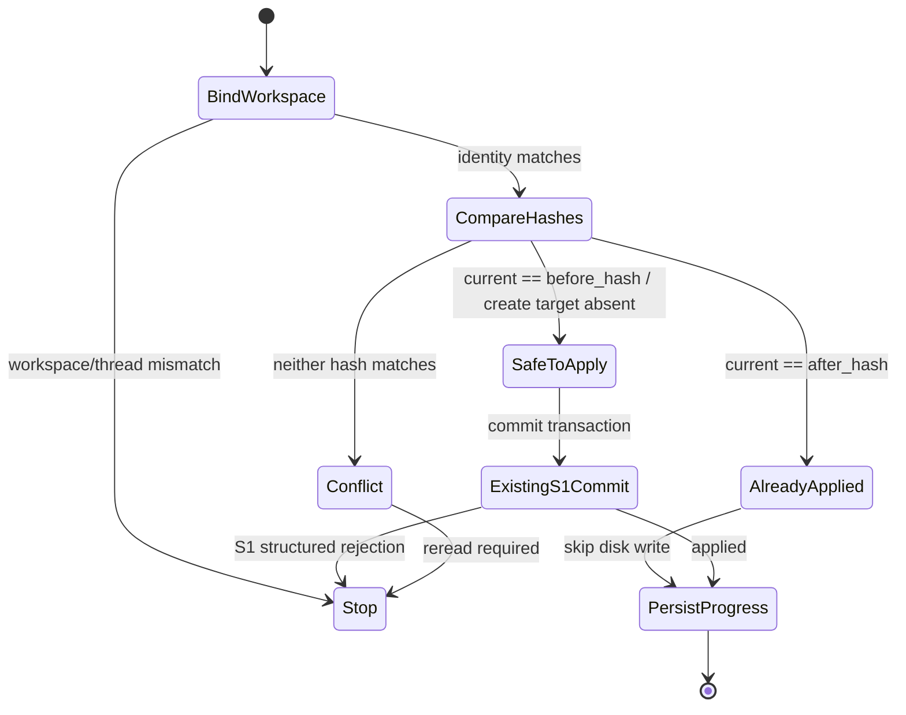

# S3 配置、预算、运行轨迹与恢复设计

调研日期：2026-09-15
固定项目基线：`8d89670e97442f652d592a3e0f6f63c373fe3717`
阶段：Design Gate，仅形成可实施、可验收的设计；本轮未修改生产代码或依赖。

## 1. 设计结论

S3 应在现有 Architect → Developer 和 S1/S2 确定性模块外增加一层很薄的运行时能力：

1. `RunConfig` 在一次运行开始前统一解析 workspace、现有模型配置、verification checks、运行 timeout、`max_steps` 和 `max_cost_usd`，随后作为不可变依赖传入图工厂。API key 不进入图状态、checkpoint 或轨迹。
2. `BudgetController` 只管理预算准入与结算；模型调用和模型发起的每个工具调用都必须先取得结构化 reservation。缺失 usage/cost 使用 `None + UNKNOWN/PARTIAL`，不能按零累计。
3. `EventSink` 与 `ArtifactStore` 分开保存小型审计事件和较大的 patch/test 内容；给模型的诊断摘要由独立的确定性 renderer 生成，不把审计记录直接送回模型。
4. 独立本地运行通过父图注入官方 `SqliteSaver`，Architect/Developer 子图继续使用默认 `compile(checkpointer=None)` 继承父 saver。恢复前先验证 `thread_id` 对应的 workspace identity。
5. Developer 的现有 `commit_file_transaction` 在每次执行或重放时先调用 `RecoveryReconciler`。文件已是预期 `after_hash` 时跳过重复写入；仍是 `before_hash` 时继续现有 S1 commit；两者都不是时停止并报告 conflict。

该方案不新增 Agent，不改变 DeepSeek/Anthropic provider，不重构 S1 `WorkspaceEditor`/`WorkspaceTransaction` 或 S2 verification/repair。checkpoint、文件写入和轨迹不是同一事务，因此只承诺检测已应用写入和冲突，不承诺 exactly-once。

## 2. 当前 S1/S2 实现审计

以下是基线源码已确认的事实，不是拟议能力：

| 边界 | 当前实现 | S3 的直接含义 |
|---|---|---|
| 配置 | `agent/config.py` 从环境分别构造 `ModelSettings`；workspace 和 verification 也由各自模块读取 | 需要一个运行级解析入口，验证一次后显式传入；保留当前两个 provider 构造分支 |
| 模型 | Architect/Developer 各自用无参数 `lru_cache` 缓存 runnable | 缓存不能继续隐式绑定首次读取的环境；runnable 应按传入的模型设置在图装配期创建 |
| 工具 | 两个子图直接使用 `ToolNode`；目录读取也直接 `.invoke()` | 需要在公开调用边界做预算准入、usage/event 记录；不修改各工具的 S1 workspace 校验 |
| 图装配 | 模块级 `swe_agent` 直接 `.compile()`，未注入 checkpointer；recursion limit 固定为 200 | 独立运行需显式 saver 生命周期和 `thread_id`；`max_steps` 不能继续依赖 recursion limit |
| 编辑 | 同文件 proposal 先进入 `WorkspaceTransaction` working copy，最后一次 `commit()`；`EditResult` 已有 `before_hash/after_hash` | 现有 staged transaction 可作为 checkpoint 中的确定性写入意图；恢复只在 commit 前增加对账，不重写编辑器 |
| 验收 | baseline/post checks、明确 outcome、最多两次 repair 已完成 | verification 命令继续由可信 `VerificationSpec` 提供；S3 只增加 deadline、事件与 artifact 引用 |
| 状态 | 顶层已有 plan、edit result、verification、repair 和 outcome；无运行身份、预算或恢复字段 | 只增加小型 `RunIdentity`、`BudgetSnapshot`、runtime error 和最近恢复结果，不把完整轨迹塞入 state |

当前锁文件实际是 `langgraph==1.2.11`、`langgraph-checkpoint==4.2.0`、`langchain-core==1.6.2`。环境中 `langgraph.checkpoint.sqlite` 不能导入，证明 SQLite saver 尚未安装。S3 实现必须保留全部 84 项 S1/S2 回归，并以新增测试证明运行时能力。

## 3. 一手源码依据

### 3.1 LangGraph 1.x SQLite saver

本项目所用 LangGraph 1.2.11 对应官方发布源码提交 [`644815f9e5bc52ad8f7a5227a456227e9c3e639b`](https://github.com/langchain-ai/langgraph/commit/644815f9e5bc52ad8f7a5227a456227e9c3e639b)。其[包声明](https://github.com/langchain-ai/langgraph/blob/644815f9e5bc52ad8f7a5227a456227e9c3e639b/libs/langgraph/pyproject.toml#L24-L31)接受 `langgraph-checkpoint>=4.1.0,<5.0.0`，与当前 4.2.0 一致。

SQLite saver 是独立包。本设计核对稳定版 `langgraph-checkpoint-sqlite==3.1.1`，固定源码提交为 [`b2926a0ff9589c28c7e01fe7cdbb337b86d5a4b4`](https://github.com/langchain-ai/langgraph/commit/b2926a0ff9589c28c7e01fe7cdbb337b86d5a4b4)：

- `SqliteSaver` 明确定位为同步、轻量、本地用途，不适合多线程扩展；异步场景另有 `AsyncSqliteSaver`：[类契约](https://github.com/langchain-ai/langgraph/blob/b2926a0ff9589c28c7e01fe7cdbb337b86d5a4b4/libs/checkpoint-sqlite/langgraph/checkpoint/sqlite/__init__.py#L40-L48)。
- `from_conn_string()` 是 context manager；编译图必须在连接存活期间使用 saver：[构造接口](https://github.com/langchain-ai/langgraph/blob/b2926a0ff9589c28c7e01fe7cdbb337b86d5a4b4/libs/checkpoint-sqlite/langgraph/checkpoint/sqlite/__init__.py#L53-L117)。
- saver 公开实现 `get_tuple/list/put/put_writes/delete_thread`：[读取](https://github.com/langchain-ai/langgraph/blob/b2926a0ff9589c28c7e01fe7cdbb337b86d5a4b4/libs/checkpoint-sqlite/langgraph/checkpoint/sqlite/__init__.py#L177-L276)、[历史](https://github.com/langchain-ai/langgraph/blob/b2926a0ff9589c28c7e01fe7cdbb337b86d5a4b4/libs/checkpoint-sqlite/langgraph/checkpoint/sqlite/__init__.py#L277-L364)、[写入](https://github.com/langchain-ai/langgraph/blob/b2926a0ff9589c28c7e01fe7cdbb337b86d5a4b4/libs/checkpoint-sqlite/langgraph/checkpoint/sqlite/__init__.py#L365-L456)。业务恢复应使用 compiled graph 的 `get_state/get_state_history`，不读取私有 SQLite 表。
- checkpoint 主键只有 `thread_id + checkpoint_ns + checkpoint_id`，不认识 workspace：[建表源码](https://github.com/langchain-ai/langgraph/blob/b2926a0ff9589c28c7e01fe7cdbb337b86d5a4b4/libs/checkpoint-sqlite/langgraph/checkpoint/sqlite/__init__.py#L119-L153)。workspace 绑定必须由本项目校验。

LangGraph 1.2.11 的 `durability="sync"` 表示进入下一 graph step 前同步持久化；`async/exit` 保证更弱：[固定类型定义](https://github.com/langchain-ai/langgraph/blob/644815f9e5bc52ad8f7a5227a456227e9c3e639b/libs/langgraph/langgraph/types.py#L82-L88)。这不能覆盖“node 内文件写成功、node state update 尚未保存”的窗口，所以恢复仍必须对账。

### 3.2 子图传播

官方 1.2.11 类型和测试确认三种行为：

| 子图 compile 参数 | 行为 | 本项目选择 |
|---|---|---|
| `checkpointer=None`，默认 | 继承父 saver，支持本次 invocation 内的 durable execution；下一次独立父图调用不累计子图状态 | Architect/Developer 保持此模式 |
| `checkpointer=True` | 使用父 saver 并跨同一 thread 的多次调用累计子图状态 | 当前不需要，避免不同任务串入角色私有消息 |
| `checkpointer=False` | 即使父图有 saver 也禁用子图 checkpoint | 不使用，会失去子图恢复能力 |

依据：[参数语义](https://github.com/langchain-ai/langgraph/blob/644815f9e5bc52ad8f7a5227a456227e9c3e639b/libs/langgraph/langgraph/types.py#L93-L110)、[默认继承并恢复](https://github.com/langchain-ai/langgraph/blob/644815f9e5bc52ad8f7a5227a456227e9c3e639b/libs/langgraph/tests/test_subgraph_persistence.py#L25-L73)、[默认跨调用重置](https://github.com/langchain-ai/langgraph/blob/644815f9e5bc52ad8f7a5227a456227e9c3e639b/libs/langgraph/tests/test_subgraph_persistence.py#L75-L130)、[`False`](https://github.com/langchain-ai/langgraph/blob/644815f9e5bc52ad8f7a5227a456227e9c3e639b/libs/langgraph/tests/test_subgraph_persistence.py#L206-L260)、[`True`](https://github.com/langchain-ai/langgraph/blob/644815f9e5bc52ad8f7a5227a456227e9c3e639b/libs/langgraph/tests/test_subgraph_persistence.py#L263-L328)。

父图恢复使用相同 `{"configurable": {"thread_id": ...}}`，并通过公开 `graph.get_state(config)` 检查状态；已有 checkpoint 的继续执行使用 `graph.invoke(None, config, durability="sync")`。官方中断测试也使用相同模式：[恢复测试](https://github.com/langchain-ai/langgraph/blob/644815f9e5bc52ad8f7a5227a456227e9c3e639b/libs/langgraph/tests/test_interruption.py#L11-L50)。

### 3.3 mini-swe-agent

固定参考提交：[`SWE-agent/mini-swe-agent@04d809c`](https://github.com/SWE-agent/mini-swe-agent/tree/04d809ceab9df28f9adaed044884180159172930)。

- 它在模型请求前检查 step/cost/wall-time，调用后累计实际成本：[执行循环](https://github.com/SWE-agent/mini-swe-agent/blob/04d809ceab9df28f9adaed044884180159172930/src/minisweagent/agents/default.py#L120-L142)。这证明“调用前准入、调用后结算”是已实现机制。
- 它在每轮 `finally` 保存 trajectory，并记录 schema 版本、配置、调用数、成本和 messages：[持续保存](https://github.com/SWE-agent/mini-swe-agent/blob/04d809ceab9df28f9adaed044884180159172930/src/minisweagent/agents/default.py#L80-L116)、[序列化](https://github.com/SWE-agent/mini-swe-agent/blob/04d809ceab9df28f9adaed044884180159172930/src/minisweagent/agents/default.py#L147-L177)。
- 其 cost limit 是超过后才阻止下一次调用，最后一次调用可能越线；源码注释也明确使用 exceeded 语义：[配置与检查](https://github.com/SWE-agent/mini-swe-agent/blob/04d809ceab9df28f9adaed044884180159172930/src/minisweagent/agents/default.py#L17-L32)。
- 它对缺失 cost 使用 `0.0`，LiteLLM 的容错路径也可能返回 `0.0`：[累计逻辑](https://github.com/SWE-agent/mini-swe-agent/blob/04d809ceab9df28f9adaed044884180159172930/src/minisweagent/agents/default.py#L92-L95)、[成本计算](https://github.com/SWE-agent/mini-swe-agent/blob/04d809ceab9df28f9adaed044884180159172930/src/minisweagent/models/litellm_model.py#L98-L116)。本项目不能照搬这一语义。

当前 `langchain-core==1.6.2` 的 `AIMessage.usage_metadata` 本身允许为 `None`：[固定定义](https://github.com/langchain-ai/langchain/blob/8215039dea978372bd3fd95b88663a11b0159043/libs/core/langchain_core/messages/ai.py#L98-L169)。因此 unknown 必须是正式状态，而不是异常补丁。

## 4. 目标模块与公开 seam

```text
agent/runtime/
  config.py       # RunConfig、环境解析和校验
  budget.py       # 预算准入、reservation、usage 结算
  calls.py        # 模型/工具调用边界；不拥有 provider
  trajectory.py   # RunEvent、RunRecord、EventSink
  artifacts.py    # ArtifactRef、ArtifactStore、文件实现
  recovery.py     # workspace/thread 绑定与文件 hash 对账
  wiring.py       # saver 生命周期、父图 compile/invoke 装配
```

### 4.1 RunConfig

概念接口如下，最终实现可用 frozen dataclass 或 Pydantic frozen model，但只能有一个公开表示：

```python
@dataclass(frozen=True, slots=True)
class RunConfig:
    workspace_root: Path
    model: ModelRunConfig
    verification_specs: tuple[VerificationSpec, ...]
    timeout_seconds: float
    max_steps: int
    max_cost_usd: Decimal | None

def load_run_config(env: Mapping[str, str]) -> RunConfig: ...
```

`ModelRunConfig` 复用现有 `ModelSettings` 的 provider/model/base_url/api_key，并可带一个可选、显式配置的 `TokenPricing` 快照。它不是 provider registry：仍只有现有 DeepSeek 和 Anthropic 两条构造分支。公开序列化只能产生不含 API key 的 `ModelDescriptor(provider, model, public_parameters, pricing_source, config_digest)`。

规则：

- `workspace_root` 在解析配置时转换为 S1 resolver 使用的 canonical 绝对目录；图、工具、编辑器和 verification runner 都接收该值。
- `verification_specs` 直接复用 S2 可信 argv 契约；不接受 LLM 生成命令。
- `timeout_seconds` 是从首次运行接纳开始计算的总 wall-clock deadline，必须是有限正数；checkpoint 保存绝对 deadline，进程停机时间也计算在内。
- `max_steps` 必须是正整数。一个模型 invocation 算一步，一个模型发起的 workspace tool invocation 算一步；一条 AIMessage 中多个 tool calls 分别计数。
- baseline/post verification 是固定验收阶段，不计入 Agent 的 `max_steps`，但必须检查剩余 wall time，并使用 `min(spec.timeout_seconds, remaining_seconds)`。这样不会因 Agent 用尽步数而静默跳过 post verification。
- `max_cost_usd` 为可选正 Decimal。内部以整数 micro-USD 累计，避免 float 比较；未配置时仍记录 usage/cost。
- 解析失败在任何模型、工具或 workspace 写入前结构化返回 `CONFIG_INVALID`。

环境变量只作为生产 loader 的一种来源。测试和库调用直接构造 `RunConfig`；不得在模块导入时读取环境或创建客户端。

### 4.2 Budget / usage

公开 seam：

```python
class CallKind(str, Enum):
    MODEL = "model"
    TOOL = "tool"

class UsageStatus(str, Enum):
    KNOWN = "known"
    PARTIAL = "partial"
    UNKNOWN = "unknown"

@dataclass(frozen=True, slots=True)
class UsageRecord:
    input_tokens: int | None
    output_tokens: int | None
    total_tokens: int | None
    cost_microusd: int | None
    status: UsageStatus
    cost_source: str | None  # provider_reported/configured_estimate/None

class BudgetController:
    def reserve(
        self, snapshot: BudgetSnapshot, requests: Sequence[CallRequest]
    ) -> BudgetDecision: ...

    def settle(
        self, snapshot: BudgetSnapshot, reservation: BudgetReservation,
        usage: Sequence[UsageRecord]
    ) -> BudgetSnapshot: ...
```

`BudgetController` 不构造模型、不执行工具、不写 checkpoint。它只返回不可变状态变化，便于图状态持久化和纯单元测试。

预算规则：

1. 每个模型/工具 dispatch 前检查 deadline、剩余 steps 和已知成本。模型一次返回多个 tool calls 时，在执行 ToolNode 批次前按原始 tool-call 顺序一次性 reservation；容量不足则整批拒绝，禁止并发工具只执行一部分。
2. reservation 成功即消耗 step；启动失败、超时、格式错误仍占一步，因为外部调用已被发起。
3. 模型结束后立即从 `AIMessage.usage_metadata` 和 provider response metadata 取 usage。缺字段为 `None`；只有 provider 明确报告零才允许 `0 + KNOWN`。
4. 成本优先使用 provider 明确返回值；否则仅在 token usage 完整且 RunConfig 固定了价格快照时计算 `CONFIGURED_ESTIMATE`；其余情况 `cost_microusd=None`。
5. 配置了 `max_cost_usd` 且一次已完成模型调用成本 unknown 后，允许处理该响应和其中已预留的本地工具，但拒绝下一次模型调用并返回 `BUDGET_USAGE_UNKNOWN`。这比把 unknown 当零安全，也避免宣称仍在成本上限内。
6. 调用前若 `known_cost >= max_cost`，拒绝新模型调用；调用后成本可能超过阈值，随后不再发起模型调用。单次费用事前未知，因此 `max_cost` 是后续调用的阻断线，不是绝对硬上限。
7. run deadline 在每个模型、工具、verification 边界检查。底层支持 timeout 时传入剩余时间；同步 provider 无法可靠取消时，只保证调用返回后不再继续，并记录 `TIMEOUT_OVERRUN`。

`BudgetSnapshot` 进入顶层/子图共享 state，至少包含 `steps_reserved`、`known_cost_microusd`、`unknown_cost_calls`、`usage_status`、`deadline_at` 和最近一次拒绝原因。不要只把计数放在进程内对象中，否则恢复后会重置预算。

### 4.3 Run trajectory

公开记录契约：

```python
class EventSink(Protocol):
    def append(self, event: RunEvent) -> None: ...

class ArtifactStore(Protocol):
    def put_bytes(
        self, *, run_id: str, kind: ArtifactKind,
        data: bytes, media_type: str
    ) -> ArtifactRef: ...
```

`RunEvent` 是小型版本化记录：

| 字段 | 规则 |
|---|---|
| `schema_version/event_id/sequence/timestamp` | `event_id` 在重放时作为去重键；sequence 只保证单次 sink 中有序 |
| `event_type` | run/model/tool/edit/verification/recovery/checkpoint 的 start/result/error，不把任意对象塞入 payload |
| `run_id/thread_id/task_id/step_id` | 所有调用与副作用事件必填；run 生命周期事件可没有 step_id |
| `model` | 只含脱敏 `ModelDescriptor`；禁止 API key、完整环境和认证 header |
| `usage` | 使用上述 `UsageRecord`，unknown 原样保存 |
| `tool_summary` | tool name、tool_call_id、参数/结果 digest、结构化状态、是否截断；不默认保存完整源码内容 |
| `error` | 稳定 error code、类型、短消息和可选 artifact；模型生成的诊断明确标记 untrusted |
| `artifact_refs` | patch、完整/截断 test log、模型大响应等内容寻址引用 |

`ArtifactRef` 至少含 `kind/path/sha256/size/media_type/truncated`。文件型 artifact store 位于不可由 Agent 编辑的 runtime 目录，先写临时文件再原子替换。S1 `EditResult.diff` 产生 patch artifact；S2 stdout/stderr 产生 test artifact，state 与 event 只保存有界摘要和引用。

图结束时生成一个小型 `RunRecord`，包含 identity、脱敏 config digest、最终 `WorkflowOutcome`、budget snapshot、起止时间、最后 event sequence、checkpoint/trajectory/artifact roots。它是结果清单，不是拥有所有依赖和行为的 `RunManager`。

审计与模型上下文严格分离：

- `EventSink` 保存审计事实，模型无权直接读取 JSONL 或原始 artifact。
- `ModelDiagnosticSummary` 由确定性 renderer 从允许的结构化结果生成，按长度截断、标记不可信数据，并保留 artifact ref。
- 原始 tool_call_id 在事件中保留；给模型的摘要只保留解决当前错误所需的有限字段。

## 5. 身份、checkpoint 与图变化

### 5.1 身份规则

```python
RunIdentity(
    run_id: str,       # 一条逻辑运行及其恢复链，恢复时不变
    thread_id: str,    # LangGraph checkpoint key，默认等于首次 run_id
    task_id: str,      # 外部用户任务身份
    workspace: WorkspaceIdentity,
)
```

`WorkspaceIdentity` 保存 S1 resolver 得到的 canonical absolute root 和其 SHA-256 digest；Windows comparison 复用 `os.path.normcase` 语义。新的用户任务即使复用 workspace 也生成新 thread。恢复链必须复用原 thread/run/task identity。

恢复入口在调用图前执行：

1. 用 `graph.get_state(thread_config)` 读取公开 snapshot。
2. 无 checkpoint：用当前 RunConfig 初始化 identity。
3. 有 checkpoint：比较 checkpoint 中的 workspace digest、canonical root、run_id/task_id。
4. workspace 不一致返回 `WORKSPACE_MISMATCH`；task/run 不一致返回 `THREAD_IDENTITY_MISMATCH`。两者都不得执行任何 graph node 或文件操作。

不能把新输入中的 workspace identity直接覆盖旧 checkpoint 后再检查。SQLite 数据库文件和 trajectory/artifact 目录必须在 editable workspace 外部。

### 5.2 图节点变化

父图拟调整：

```text
external preflight: validate thread/workspace binding
    ↓
initialize_run（仅新 thread）
    ↓
现有 Architect → baseline → Developer → post → bounded repair
    ↓
现有 finalize_outcome → finalize_run_record → END
```

- `create_workflow_graph(...)` 接收不可变 `RunConfig`、`BudgetController`、`EventSink`、`ArtifactStore`；测试继续可注入 fake model/runner。
- 本地装配函数在 `SqliteSaver` context 生命周期内执行 `parent_builder.compile(checkpointer=saver)`，每次 invoke 显式传 `thread_id` 和 `durability="sync"`。
- Architect/Developer 子图继续默认 `compile()`，让父 saver 传播；不设置 `True`，不为子图创建独立 saver。
- 模型节点通过 `ModelCallBoundary` 返回业务结果、usage、budget update 和事件；工具节点通过保留 ToolMessage 协议的 budget-aware executor 批量预留并执行，不改工具业务逻辑。
- `finalize_run_record` 只封存已有结果和 artifact refs；记录失败不得把 S2 FAILED/UNVERIFIED 等终态改写成成功。

Developer 只做一处恢复相关行为变化：现有 `commit_file_transaction` 内部先执行 hash reconcile，再决定调用现有 `WorkspaceEditor.commit()`、合成已应用结果或停止。必须放在 commit node 内，因为崩溃恢复可能直接重放该 node，不会重新经过其前一个 graph node。

### 5.3 AgentState 新字段

顶层新增字段保持精简：

```text
run_identity: RunIdentity | None
run_config_digest: str
budget: BudgetSnapshot
runtime_error_code: RuntimeErrorCode | None
runtime_message: str
last_recovery_result: RecoveryResult | None
trajectory_ref: str | None
```

Developer state 增加 `pending_write: WriteIntent | None`。`WriteIntent` 只保存 `path/existed/before_hash/expected_after_hash/task_ids`；实际 working copy 继续由已有 `WorkspaceTransaction` 保存。`expected_after_hash` 在最后一次 stage 成功时从将要写入的 UTF-8 bytes 计算，并在 commit 之前随子图 checkpoint 持久化。

`RuntimeErrorCode` 至少区分 `CONFIG_INVALID/MAX_STEPS/MAX_COST/BUDGET_USAGE_UNKNOWN/RUN_TIMEOUT/WORKSPACE_MISMATCH/THREAD_IDENTITY_MISMATCH/RECOVERY_CONFLICT/CHECKPOINT_ERROR/TRAJECTORY_ERROR`。这些错误令整体 outcome 为 `FAILED`，不扩大 S2 verification 状态枚举。

## 6. 文件恢复状态机

公开 seam：

```python
class RecoveryStatus(str, Enum):
    SAFE_TO_APPLY = "safe_to_apply"
    ALREADY_APPLIED = "already_applied"
    CONFLICT = "conflict"

class RecoveryReconciler:
    def reconcile(
        self, transaction: WorkspaceTransaction, intent: WriteIntent
    ) -> RecoveryResult: ...
```

所有读取继续经过 S1 `WorkspacePathResolver`。判断表：

| 写入类型 | 当前文件状态 | 结果 | 动作 |
|---|---|---|---|
| edit | `current_hash == expected_after_hash` | `ALREADY_APPLIED` | 合成等价 `EditResult(APPLIED)`，禁止第二次 commit |
| edit | `current_hash == before_hash` | `SAFE_TO_APPLY` | 调用现有 `WorkspaceEditor.commit(transaction)` |
| edit | 缺失或 hash 为第三值 | `CONFLICT` | outcome FAILED，记录实际 hash，停止并要求重读 |
| create | 文件不存在且 `before_hash is None` | `SAFE_TO_APPLY` | 调用现有 commit |
| create | 文件存在且 hash 等于 expected after | `ALREADY_APPLIED` | 合成结果，不重复 create |
| create | 文件存在但 hash 不同 | `CONFLICT` | 停止，不覆盖 |

状态流：



恢复事件必须记录 decision、三个 hash、path 和 task ids，但不把完整文件内容写入事件。`ALREADY_APPLIED` 后产生正常 state update，让下一次 `durability="sync"` checkpoint 记录逻辑进展。

## 7. 故障注入与测试矩阵

测试只使用公开 seam、compiled graph 输出、`get_state()`、最终文件 bytes 和 event/artifact 内容，不断言 LangGraph 私有 SQLite 表或内部调用顺序。

### 7.1 RunConfig

| 用例 | 预期 |
|---|---|
| 自定义 workspace/model/verification/limits | 读、写、runner、模型工厂均接收同一个 config |
| timeout 为 0、负数、NaN、Infinity | `CONFIG_INVALID`，零外部调用 |
| max_steps 非正整数；max_cost 非正/非有限 | 结构化拒绝 |
| DeepSeek/Anthropic 显式配置 | 继续构造当前 provider；无新增 provider |
| config/event/checkpoint 序列化 | 不出现 API key；descriptor digest 稳定 |

### 7.2 Budget / usage

| 用例 | 预期 |
|---|---|
| max_steps 恰好 N | 第 N 次 model/tool dispatch 可执行，第 N+1 次在调用前拒绝 |
| 多 tool-call 批次容量不足 | 整批零执行，顺序确定 |
| 模型/工具启动失败或 timeout | 已预留 step 不退回，错误事件存在 |
| 完整 token + provider cost | `KNOWN`，准确累计 micro-USD |
| 完整 token + 固定 pricing | `CONFIGURED_ESTIMATE`，配置 digest 可追溯 |
| token/cost 缺失或部分存在 | `UNKNOWN/PARTIAL + None`，绝不写 0 |
| max_cost 前置已达到 | 下一模型调用零执行 |
| 单次调用跨过 max_cost | 当前 usage 记录，后续模型调用拒绝；文档不称硬上限 |
| 配置 max_cost 后遇 unknown cost | 当前响应可完成，下一模型调用返回 `BUDGET_USAGE_UNKNOWN` |
| deadline 在 model/tool/verification 前耗尽 | 不发起对应调用；整体 FAILED，保留原 S2 诊断 |

### 7.3 Trajectory / artifact

| 用例 | 预期 |
|---|---|
| 正常模型→工具→编辑→verification | 事件带同一 run/task、单调 step、tool_call_id 和最终 record |
| 模型异常且 usage 可得/不可得 | 分别记录 known/unknown，不丢 error |
| patch 与超长 test 输出 | event 只有 digest/有界摘要，artifact hash/size/truncation 正确 |
| 给模型的 repair feedback | 不含 raw event；诊断标记 untrusted 并保留 artifact ref |
| secret canary | JSONL、checkpoint、artifact 元数据均无 API key |
| event sink 写失败 | `TRAJECTORY_ERROR`，禁止继续新的模型或写盘副作用；已发生调用如实报告 |

### 7.4 SQLite 与子图

| 用例 | 预期 |
|---|---|
| 父图注入真实 `SqliteSaver`，子图默认 compile | Architect/Developer 状态可随同一 thread 恢复 |
| 重开 SQLite 连接和重建 compiled graph | `graph.get_state()` 仍能定位 pending node |
| 同 thread + 同 workspace | 允许 `invoke(None, ..., durability="sync")` |
| 同 thread + 不同 workspace/task/run | preflight 结构化拒绝，零 graph node/文件调用 |
| 新 thread + 同 workspace | 独立新运行，不继承旧子图消息或预算 |

### 7.5 写成功但 checkpoint 未保存

核心验收必须真实覆盖用户指定窗口：

1. 用真实临时 workspace、真实文件型 `SqliteSaver`、fake model 和现有 Developer 图完成 stage checkpoint。
2. 通过现有 `DeveloperRuntime.edit_executor` 注入一个委托包装器：先让真实 `WorkspaceEditor.commit()` 完成原子写入，再抛 `InjectedCrash`，模拟 commit node 尚未返回 state update。
3. 断言文件已经是 expected after hash；用公开 `graph.get_state(thread_config).next` 证明 thread 仍待执行 commit/recovery 边界。
4. 关闭 SQLite 连接并重建 graph/saver，用相同 thread 调用 `invoke(None, ..., durability="sync")`。
5. `RecoveryReconciler` 必须返回 `ALREADY_APPLIED`，最终完成且没有第二次写盘。通过注入式 writer 的公开计数与最终文件 metadata/bytes 验证，不读私有数据库表。
6. 再做黑盒 subprocess 变体，在写成功后 `os._exit()`，由新 Python 进程重开 DB 并恢复，证明不是同进程对象残留造成的假恢复。

同一 fixture 追加三种分支：

- 崩溃后把文件恢复为 before bytes：`SAFE_TO_APPLY`，S1 commit 正常执行一次。
- 崩溃后写入第三种 bytes：`CONFLICT`，文件 byte-identical，不进入 verification/repair。
- create 写入后崩溃：相同内容判 `ALREADY_APPLIED`；不同内容判 `CONFLICT`。

恢复测试必须同时保留所有 S1/S2 测试，并补 `baseline → Developer → post → repair → outcome` 在有 saver 时的顶层 fake-model 回归。

## 8. 拟修改文件

下列是后续 S3 Implementation Gate 的计划，不是本次已修改内容：

| 文件 | 计划变化 |
|---|---|
| `agent/runtime/{config,budget,calls,trajectory,artifacts,recovery,wiring}.py` | 新增上述小型公开 seam 和文件实现 |
| `agent/runtime/__init__.py` | 只导出稳定 contracts |
| `agent/config.py` | 让现有 DeepSeek/Anthropic 构造接收显式 ModelSettings；不再由 cached runnable 隐式读环境 |
| `agent/graph.py` | 接收 RunConfig/runtime seams，增加 initialize/finalize record，父图 compile 时可注入 saver |
| `agent/architect/runtime.py`、`agent/developer/runtime.py` | 在现有 callable 外接 model boundary；缓存按显式配置装配 |
| `agent/architect/graph.py`、`agent/developer/graph.py` | 工具 batch 预算准入；Developer commit node 内加入 recovery reconcile |
| `agent/developer/state.py` | 增加 `pending_write`；保留全部 S1 transaction 字段 |
| `agent/editing/models.py` | 只在确有需要时新增 `WriteIntent`，不改变 editor/transaction 公开语义 |
| `tests/runtime/test_{config,budget,trajectory,recovery}.py` | 确定性 contracts 和边界测试 |
| `tests/runtime/test_checkpoint_integration.py` | 真实 SQLite、子图传播、重开进程与 crash-window 测试 |
| `tests/test_graph_integration.py` | 顶层身份、预算、最终 record 与 S1/S2 传播回归 |
| `pyproject.toml`、`uv.lock` | 只新增 SQLite saver 依赖并锁定，不升级现有主依赖 |
| `.env.example`、`README.md` | 记录可信配置、恢复命令、unknown usage 与非 exactly-once 边界 |

`agent/state.py` 是当前未参与主图的旧状态文件，S3 不借机清理。现有 S1/S2 文件只做连接 seam 所需的最小变化。

## 9. 必要依赖变化

本 Design Gate 不修改依赖。后续实现唯一必要新增生产依赖为：

```toml
"langgraph-checkpoint-sqlite>=3.1.1,<4.0.0"
```

`uv.lock` 应在实现提交中固定到已验证版本 3.1.1。该版本[包声明](https://github.com/langchain-ai/langgraph/blob/b2926a0ff9589c28c7e01fe7cdbb337b86d5a4b4/libs/checkpoint-sqlite/pyproject.toml#L5-L17)要求 `langgraph-checkpoint>=4.1.0,<5.0.0`，与当前 4.2.0 兼容，并会带入 `aiosqlite`、`sqlite-vec`。当前执行路径仍使用同步 `SqliteSaver`，不同时实现 async adapter。

不新增配置框架、provider SDK、数据库 ORM、成本服务或 telemetry 平台。JSONL/artifact 文件实现只使用标准库。

## 10. 实施顺序

后续应继续小步交付，而不是一次完成全部 S3：

1. **S3.1 Config + Budget**：公开 contracts、环境解析、显式模型装配和纯预算测试；尚不启用 checkpoint。
2. **S3.2 Trajectory**：模型/工具边界事件、usage unknown、patch/test artifacts；用 fake model 验证，不改变 recovery。
3. **S3.3 Checkpoint wiring**：新增 SQLite 依赖、父 saver、thread/workspace preflight、子图传播集成测试。
4. **S3.4 Recovery reconcile**：Developer commit 前 hash 状态机、异常和 subprocess crash-window 测试。
5. **S3 Final Gate**：全量 S1/S2/S3、compile、prompt render、diff check、真实 DeepSeek smoke；只声明实测结果。

每片必须能独立回退和验收。若 S3.3 的真实版本测试与上述官方语义不一致，先停在 Design Gate 重新核对，不用兼容代码掩盖差异。

## 11. 已知限制

- `max_steps` 可以在 dispatch 前形成确定性边界；`max_cost` 只能基于已经返回或可靠估算的成本阻止后续调用，不能保证账单绝不超过阈值。
- provider 不返回 usage、且未配置价格快照时，成本保持 unknown；配置了 max cost 的运行会在下一模型调用前保守停止。
- run deadline 包含进程停机时间。同步 provider 或工具不支持取消时，timeout 只能阻止后续动作，不能保证立即终止正在阻塞的调用。
- SQLite saver 适合本地单进程/轻量同步运行，不适合多进程服务。LangGraph Agent Server 的托管 persistence 是另一部署路径，不能把本地 SQLite 测试结果直接外推。
- checkpoint 会序列化 Developer working copy，长文件会增大数据库；S3 先测量后再决定是否将内容 artifact 化，不提前建立 storage registry。
- checkpoint、event JSONL、artifact 和 workspace 文件没有跨介质事务。崩溃后可能出现事件重复或落后，因此事件带 idempotency key，审计消费者按 event_id 去重。
- 文件 hash 对账只保护已知 S1 write intent。模型/API/tool 调用在 checkpoint 前崩溃仍可能被重放；本轮不承诺这些外部副作用 exactly-once。
- `ALREADY_APPLIED` 证明当前 bytes 等于预期结果，不证明文件在崩溃窗口中从未被第三方改动后又改回。
- recovery conflict 只停止并要求重读，不自动 merge、rollback、重规划或启动新 Agent。

## 12. 本轮交付边界

本轮只提交本设计文档和 `task_plan.md`。没有修改生产代码、依赖、provider、prompt 或测试，也没有运行 S3 功能测试。文中的接口、状态和测试均为下一阶段的明确实施与验收契约；只有固定源码事实和当前基线审计属于已确认结论。
