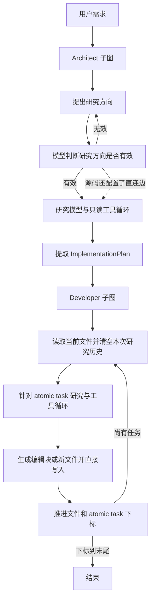
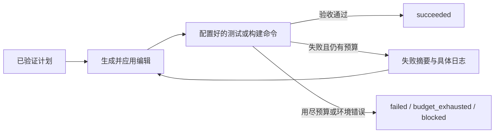

# SWE Agent 架构与渐进优化调研

调研日期：2026-09-08。目标是 Agent 开发求职项目；本轮交付源码分析、参考机制和验收方案，不实施业务改造。

## 1. 结论

建议保留 LangGraph 和 Architect → Developer 的基本分工，先把项目做成**能可靠修改代码、用执行结果判断成败、出现失败可以定位和恢复的工程 Agent**。当前最值得投入的是执行闭环，而不是增加角色或更换框架。

已找到有源码和测试的可借鉴机制。它们证明方案不是凭空构想；能否提高本项目任务成功率、降低成本，仍须在相同模型与任务集上做对照。现在不承诺提升百分比，也不把参考项目成绩当成本项目成绩。

建议次序：**基线与确定性缺陷 → 可靠编辑 → 测试验收与有限修复 → 可恢复运行 → 检索与上下文效率 → 按证据调整规划策略**。

## 2. 实际架构：已经有什么，缺在哪里

固定分析版本：[langtalks/swe-agent@5946af4](https://github.com/langtalks/swe-agent/tree/5946af4f57cba03761015837ad5f87ef5c8d99e9)，提交日期 2026-03-28。这是 LangTalks 的项目，与 SWE-agent 官方同名项目须区分。



依据：[主图][target-main]、[Architect][target-architect]、[Developer][target-dev]。

值得保留：子图职责已有区分；计划是 Pydantic 数据结构；工具集合较小；代码按角色与工具分目录。两个核心图文件约 175/239 行，问题不是“文件太大”，而是编辑节点同时承担模型调用、格式解析、文件变更，难以独立验证与安全重试。

具体边界：

| 层 | 实际实现 | 对优化的含义 |
|---|---|---|
| 编排 | 两个子图串行；主图共享计划和研究消息 | 没必要先重写编排框架；应新增明确执行结果与失败路径 |
| 计划 | file_path、logical_task、atomic_tasks；无显式验收条件和状态 | “原子任务”是提示词粒度，并非文件事务或原子提交 |
| 编辑 | 正则提取模型文本，再按原始行号切片替换 | 应提取独立编辑器，让确定性代码决定是否允许写入 |
| 检索 | Python 关键词搜索、Tree-sitter 定义/函数提取、原文读取 | 当前不是 embedding 语义检索；先补准确性与范围控制 |
| 运行 | 模块导入时绑定固定 ChatAnthropic；递归上限 200 | 缺少每次运行的模型/工作区/预算配置契约 |
| 验收 | 根据任务下标结束 | “计划遍历完”不等于“业务正常” |
| 恢复 | 源码 compile 未显式注入 checkpointer | 独立运行缺少恢复保证；托管 LangGraph 运行时可能另外提供持久化，需分别验证 |

计划结构见 [entities.py][target-entities]；当前依赖不是凭 README 推断：[uv.lock][target-lock] 锁定 LangGraph 0.6.3、langchain-core 0.3.72、langchain-anthropic 0.3.5、tree-sitter 0.21.3。

## 3. 可以具体定位的问题

### 已通过隔离执行复现

执行的是固定版本的原始函数 AST，模型响应使用固定桩，所有写入落在临时目录。没有启动完整图或真实模型。复现程序：[reproduce_baseline.py](reproduce_baseline.py)，结果：[baseline-diagnostics.json](baseline-diagnostics.json)。

| 问题 | 源码与触发条件 | 观察到的行为 |
|---|---|---|
| 多块编辑行号漂移 | [Developer 167–190 行][target-edit]；同一响应内第一个编辑块增加一行，后一个仍用旧行号 | 原本要改第 4 行 D，实际改了当前第 4 行 C，旧 D 保留下来 |
| 原文不符仍覆盖 | 同一段代码读取 old snippet 的行号，却不比较 old snippet 内容 | 提供与实际 B 不符的原文仍覆盖 B |
| 无有效编辑块静默结束 | 正则没有解析出 block；节点返回 None | 文件不变、没有错误结果；图的下一条边仍是推进下标 |
| 空计划越界 | [Developer 89–96 行][target-dev]；START 后先进入 prepare，未先检查任务数 | tasks=[] 时抛 IndexError |

### 已静态确认，运行影响仍需验证

- **研究分支混用**：[Architect 154–162 行][target-route]同时配置条件边与通往 conduct_research 的普通边。目标锁定版本 [LangGraph 0.6.3 编译代码](https://github.com/langchain-ai/langgraph/blob/0.6.3/libs/langgraph/langgraph/graph/state.py#L879-L892)分别挂载两者，条件路由不会自动替换普通边。应删除多余边并用桩模型验证无效研究不会执行工具；具体并发写状态错误不能在未跑图时宣称已复现。
- **缺少执行验收**：[Developer 的完整节点和路由][target-dev]没有测试/构建命令节点；终止判断只比较任务下标。完整文件树中也未见 tests/ 和 CI workflow。README 提到验证不等于已经实现自动验收。
- **工作区边界未统一**：研究目录硬编码为 `./workspace_repo`，编辑和原文读取直接接收路径；没有统一的根目录约束。新增文件分支直接 open，未创建父目录。现有 `create_file` 工具虽创建目录，却未被该写入路径使用，其“存在则报错”的说明也与实现不符。[编辑源码][target-dev]、[write.py][target-write]
- **工具契约和多语言支持不完整**：关键词工具固定 `.py`；codemap 声明 JS/TS/TSX，但查询仍使用 Python 的 class_definition/function_definition/block。应按语言配置 grammar/query，并验证 TSX 独立 grammar；不能据扩展名映射宣称多语言已可靠支持。[search.py][target-search]、[codemap.py][target-codemap]
- **消息压缩方式丢失结构**：两个图都把工具调用转成普通消息，且仅取 `tool_calls[0]`。多工具调用时会丢掉其余调用的描述，调用与结果的 ID 关系也未保留。完整协议消息适合执行轨迹，摘要应作为单独的规划输入。[Architect 88–102 行][target-architect]、[Developer 111–125 行][target-dev]
- **上下文与预算缺口**：研究历史累积，工具返回无明确容量上限，目录结构多处重新生成；各节点固定模型。可能造成重复成本，但尚无实测 token、耗时或成功率数据，不能给出节省比例。

## 4. GitHub 参考项目：只取适合当前问题的机制

更完整的源码路径、测试、版本与限制见 [独立参考调研](reference-projects.md) 和 [证据索引](../notes.md)。参考分支会变化，以下结论以固定提交为准。

| 项目 | 具体学习什么 | 为什么适合 | 不直接照搬的部分 |
|---|---|---|---|
| [Deep Agents][deep] | old_string 唯一匹配、EditResult、文件后端接口、历史外存与压缩 | 直接对应错误覆盖、错误反馈和上下文边界 | 其后端不提供整批文件事务；virtual_mode 不等于沙箱；全量依赖升级代价大 |
| [mini-swe-agent](https://github.com/SWE-agent/mini-swe-agent) | Agent/Model/Environment 分层、步骤/费用/时间限制、trajectory、工具错误反馈 | 适合把执行控制提取成小模块，并保留简洁 Agent loop | 单 Agent 不必立即替代现有两个子图；预算检查也不保证零超支 |
| [Aider](https://github.com/Aider-AI/aider) | 编辑失败反馈与修复、带 token 预算的 repo map、按语言配置 Tree-sitter query | 对应编辑可诊断性和大型代码库定位 | 编辑器有宽松匹配及跨文件 fallback；不能当成严格唯一匹配方案 |
| [LangGraph][lg] | 文件型 SQLite checkpoint、thread_id、中断恢复及相关测试 | 当前已经采用该框架，能逐步补运行能力 | 恢复状态不自动回滚文件；不能宣称 exactly-once 副作用 |
| [SWE-bench](https://github.com/SWE-bench/SWE-bench) | 固定基线、应用 patch、隔离测试、FAIL_TO_PASS/PASS_TO_PASS | 将“看起来完成”改成可复核任务结果 | 不能把小型自建集叫 SWE-bench Verified，完整 benchmark 成本另算 |

Deep Agents 的[唯一匹配函数][deep-replace]有[明确测试][deep-replace-tests]；本轮还隔离执行了其原函数，验证唯一匹配成功、无匹配/多匹配/空匹配拒绝。只证明这一契约在小例子上可用，不代表完整后端集成已通过。

两个容易误读的细节：

1. Deep Agents 某个测试名字含 `aborts_on_backend_failure`，但[实际断言][deep-summary-test]是存储失败告警后继续压缩，且 file_path=None。若项目强调可回放，应自行选择“轨迹持久化失败则保留原消息”的策略并验证，不能声称参考项目已有该保证。
2. 其[当前源码依赖][deep-deps]要求 langchain-core>=1.6.2，而目标锁定 0.3.72。可先移植小型契约与算法思想；直接引入整个 Deep Agents 不属于低成本优化。

目标、Deep Agents、mini-swe-agent 使用 MIT，Aider 使用 Apache-2.0；LangGraph SQLite 包与 SWE-bench 的许可证据见索引及参考报告。若复制代码应遵守对应许可并保留所需版权、署名和修改说明；benchmark 数据和容器内依赖另外按各自许可处理。

## 5. 建议的模块边界与修改细节

这是拟议设计，不是已完成实现。先保留现有子图；只在对应切片落地时增加模块，避免一次铺满目录。

```text
agent/
  graph.py                 # 子图编排与明确终态
  architect/               # 研究、计划及计划验证
  developer/               # 执行、失败反馈和有限修复路由
  contracts.py             # 计划、编辑结果、验收结果等小型数据契约
  editing/                 # 解析、预检、应用；无模型调用
  runtime/                 # 模型配置、预算、工作区、轨迹、checkpoint 装配
  tools/                   # 限量检索与按需读取，通过统一工作区接口访问
  verification/            # 命令执行和确定性验收判定
evals/                     # 固定任务、环境说明、对照运行及报告
```

不要把 runtime 建成万能管理器；ModelClient、Workspace、RunRecorder 可以先是简单 Protocol/函数，通过构造参数传入。是否要 registry 等后续出现实际扩展需求再定。

### P0：编辑正确性与完成条件

- 先修重复路由、空计划、无有效编辑输出、缺失父目录等确定性缺陷；空计划区分“合法无需修改”和“规划失败”。
- 将当前 `creating_diffs_for_task` 拆成**生成提案 → 校验提案 → 应用编辑**。模型只负责提案。
- `EditProposal` 最小字段：task_id、相对 path、operation(create/edit)、base_hash、old_text、new_text。edit 默认只允许唯一命中；create 必须明确文件不存在；暂不引入模糊匹配。
- 全部编辑先在内存副本预检；同一文件的多个编辑定义为按顺序作用于工作副本，遇到冲突整文件拒绝。提交前再次核查 base_hash；生成临时文件后原子替换。单文件原子替换不代表跨文件事务，Windows 打开文件和权限失败需测试。
- `EditResult` 显式区分 applied/rejected/noop，返回错误码、before_hash、after_hash、实际 diff；noop 不自动算任务成功。预检失败不能继续推进下标。
- 所有路径经统一 Workspace 解析并限制在工作副本中；覆盖绝对路径、`..`、符号链接/junction 和并发变更的验收用例。worktree 提供版本隔离，本身不是代码执行沙箱。

依据：[Deep Agents 替换与结果契约][deep-replace]、[后端协议][deep-result]，以及本轮原始编辑函数诊断。哈希预条件、单文件事务和工作区恢复是本项目拟新增保证，不能归功于参考项目已替你实现。

### P0/P1：测试验收与有限修复

推荐在可靠编辑之后形成首个业务闭环：



- 首版使用用户/仓库配置的命令和超时，不让 LLM 自由宣布测试通过。命令执行应在隔离环境中进行，stdout/stderr 限量并保留完整日志引用。
- `VerificationResult` 至少含 command、exit_code、timeout、log_ref、checks；测试前记录基线，分开既有失败、补丁新增失败和环境失败。
- 修复上限初始可设 2 次，属于待调参数；重复相同 patch 或相同错误时提前结束。失败时先重读变化文件、修具体错误，确需修改范围才重新规划。
- 接受条件是配置的验收检查通过，不声称“任何业务都绝对正确”。没有可执行验收时返回 unverified，不能伪装 succeeded。

依据：Aider 的失败反馈机制和 SWE-bench 的测试驱动判定。收益用真实任务成功率和回归结果证明。

### P1：配置、预算、轨迹与恢复

- `RunConfig` 保存工作区、模型/供应商、timeout、max_steps、max_cost；模块加载时不创建具体模型。先支持一个生产适配器和 fake model，不急着加多供应商。
- 预算在模型与工具调用边界统一检查；设置输出上限和命令超时。费用按可得 usage 记录，缺失写 unknown，不按 0 计算。预调用预算检查仍可能超出单次调用费用，不能称为绝对硬上限。
- 记录 run_id、task_id、step_id、模型配置、usage、工具参数/结果摘要、错误、代码版本、patch/test artifact。保留 tool_call_id 的原始关联，审计日志与给模型看的摘要分开。
- 独立运行用文件型 SQLite saver 注入主图，并核实对子图的传播；thread_id 与工作副本固定绑定。checkpoint 与文件 hash/操作记录对账后再恢复。
- 将模型生成节点与写入节点拆开；恢复后若目标 after_hash 已存在，可判定该次写入已应用。遇到既非 before_hash 也非 after_hash 的内容则停止并重读，避免重复覆盖。
- 对“写入成功、checkpoint 尚未保存时进程退出”做故障注入；没有事务协调前，只承诺可检测重复与冲突，不能承诺分布式 exactly-once。

依据：mini-swe-agent 的小型执行循环；[LangGraph SQLite][lg-sqlite]和[中断恢复测试][lg-resume]。

### P1/P2：检索正确性与上下文效率

- 第一层用 rg 的文件/关键词检索，明确忽略规则、范围、max_results 和 max_bytes；结果带 path、行号、是否截断。非 Python 文件必须能搜到。
- 第二层按 Python/JS/TS/TSX 配置并测试符号查询；保留原始字节范围而非重构函数体。解析失败返回可诊断错误并退回文本读取。
- 第三层才评估 Aider 式 repo map：定义/引用关系、任务相关排序和 token 预算。缓存用路径+内容哈希/版本标识，在编辑后失效；不能跨代码版本复用过时片段。
- 限制工具输出，完整内容存 artifact；保留近期完整工具交互，把长程研究结论转成带源码定位的 EvidenceRef。达到阈值才摘要，避免每轮额外调用模型。
- 用定位准确率、实际输入 token、缓存命中率和最终解决率对照；如果只降低 token 却漏掉验收所需文件，则不接受。

依据：Aider repo map 与多语言 queries；Deep Agents 的分页/截断结果契约及上下文压缩实现。向量库、GraphRAG、长期记忆暂不作为前置条件。

## 6. 如何证明更优秀

先建立版本 A（原始行为基线）和 B（单个切片），固定模型标识、提示词版本、依赖、目标仓库 commit、环境镜像与预算。原版不能正常启动时先记录 blocker；若使用共同兼容修复，明确两组都使用什么修复，不冒充未经改动的原版。

建议先收集约 20 个固定小任务，覆盖单文件修复、跨文件修改、新建目录、多处编辑、已有测试失败和长输出。保留一部分任务不用于调提示词；模型任务做多次运行并报告波动。这个规模用于工程回归筛选，不足以证明普遍 benchmark 优势。

| 维度 | 必须记录 | 接受标准 |
|---|---|---|
| 编辑契约 | 正确应用、错误拒绝、意外文件变化 | 确定性回归用例全部通过；无静默成功或错误覆盖 |
| 任务质量 | resolved/attempted、目标检查、既有测试回归 | 不能靠放宽测试或遗漏失败任务提高成功率 |
| 效率 | 每次运行 token/费用/耗时、每个成功任务成本 | 与质量一起比较，失败运行也计入成本；明确样本数和波动 |
| 可靠性 | 异常终态、重复写入、恢复一致性、预算退出 | 故障注入后文件和操作记录可对账，不重复破坏性写入 |
| 检索 | 标注任务的文件定位质量、输入长度、失效缓存 | 节省上下文同时不降低定位/任务质量 |

之后按环境与成本选择 SWE-bench 子集。保留完整 instance ID、补丁、测试日志和运行配置，区分 FAIL_TO_PASS 与 PASS_TO_PASS；不使用其他 Agent 公布的分数填简历。依据：[官方评分代码](https://github.com/SWE-bench/SWE-bench/blob/02e7a74ffd0b707aab73d203fe87bdc7c76afc8e/swebench/harness/grading.py#L287-L326)与[官方执行器](https://github.com/SWE-bench/SWE-bench/blob/02e7a74ffd0b707aab73d203fe87bdc7c76afc8e/swebench/harness/run_evaluation.py)。

## 7. 下一步只实施哪个切片

**建议先做“可校验编辑器”，同时修掉阻塞其演示的路由/空计划问题。**范围：保留现有研究规划，替换 Developer 中的直接文件写入；补 EditProposal/EditResult、工作区约束、原文唯一匹配、哈希预检、失败反馈和确定性回归用例。测试验收与有限修复放紧接着的第二个切片。

第一片验收示例：同一文件先插入再修改不会错位；旧原文不符/多处命中/文件外部变化时不写入；无有效编辑块明确失败；新目录创建符合策略；失败时不推进任务；编码/换行不被无意破坏。恢复、沙箱、多语言 repo map 暂不混在这次改造里。

预计相对工作量：确定性修复低；可靠编辑和测试闭环中；checkpoint 与文件一致性中高；repo map 与上下文策略中高。尚未实施和建立基线，不给虚假的精确工期或性能提升承诺。

对简历最有价值的成果会是：**清楚说明原项目缺陷 → 独立实现执行保证 → 用可复现评测证明变化**。最终可以描述为“基于 LangGraph 开源项目构建的可验证代码修改 Agent”，并明确本人负责的模块；等指标实测后再写具体成功率和成本变化。

## 8. 本轮验证范围与复现

- 已完成目标核心源码、完整文件树、锁文件与参考实现核查；四项基线行为复现；参考精确替换原函数四项契约检查。
- 未完成真实模型端到端测试、完整 LangGraph 图运行、Tree-sitter 多语言运行、沙箱测试及 SWE-bench 评测。所有整体验收收益待实施验证。
- 未修改上游项目业务代码；本地仅提交调研文档和诊断程序。

复现基线：用 PowerShell 7 将 [固定 developer/graph.py](https://raw.githubusercontent.com/langtalks/swe-agent/5946af4f57cba03761015837ad5f87ef5c8d99e9/agent/developer/graph.py) 保存到 `.research-cache/agent/developer/graph.py`，在项目根目录运行 `python research/reproduce_baseline.py`。缓存已 gitignore，不提交上游源码。诊断 JSON 中的 SHA256 是本地源码文件的字节指纹，换行格式变化会改变它。

[target-main]: https://github.com/langtalks/swe-agent/blob/5946af4f57cba03761015837ad5f87ef5c8d99e9/agent/graph.py#L14-L29
[target-architect]: https://github.com/langtalks/swe-agent/blob/5946af4f57cba03761015837ad5f87ef5c8d99e9/agent/architect/graph.py
[target-route]: https://github.com/langtalks/swe-agent/blob/5946af4f57cba03761015837ad5f87ef5c8d99e9/agent/architect/graph.py#L154-L162
[target-dev]: https://github.com/langtalks/swe-agent/blob/5946af4f57cba03761015837ad5f87ef5c8d99e9/agent/developer/graph.py
[target-edit]: https://github.com/langtalks/swe-agent/blob/5946af4f57cba03761015837ad5f87ef5c8d99e9/agent/developer/graph.py#L167-L190
[target-entities]: https://github.com/langtalks/swe-agent/blob/5946af4f57cba03761015837ad5f87ef5c8d99e9/agent/common/entities.py
[target-lock]: https://github.com/langtalks/swe-agent/blob/5946af4f57cba03761015837ad5f87ef5c8d99e9/uv.lock
[target-write]: https://github.com/langtalks/swe-agent/blob/5946af4f57cba03761015837ad5f87ef5c8d99e9/agent/tools/write.py
[target-search]: https://github.com/langtalks/swe-agent/blob/5946af4f57cba03761015837ad5f87ef5c8d99e9/agent/tools/search.py#L88-L102
[target-codemap]: https://github.com/langtalks/swe-agent/blob/5946af4f57cba03761015837ad5f87ef5c8d99e9/agent/tools/codemap.py
[deep]: https://github.com/langchain-ai/deepagents/tree/18106be837bcdd9005b2dd73280d871a0621bf99
[deep-replace]: https://github.com/langchain-ai/deepagents/blob/18106be837bcdd9005b2dd73280d871a0621bf99/libs/deepagents/deepagents/backends/utils.py#L521-L578
[deep-replace-tests]: https://github.com/langchain-ai/deepagents/blob/18106be837bcdd9005b2dd73280d871a0621bf99/libs/deepagents/tests/unit_tests/backends/test_utils.py#L415-L457
[deep-result]: https://github.com/langchain-ai/deepagents/blob/18106be837bcdd9005b2dd73280d871a0621bf99/libs/deepagents/deepagents/backends/protocol.py#L278-L310
[deep-summary-test]: https://github.com/langchain-ai/deepagents/blob/18106be837bcdd9005b2dd73280d871a0621bf99/libs/deepagents/tests/unit_tests/middleware/test_summarization_middleware.py#L1215-L1243
[deep-deps]: https://github.com/langchain-ai/deepagents/blob/18106be837bcdd9005b2dd73280d871a0621bf99/libs/deepagents/pyproject.toml#L22-L30
[lg]: https://github.com/langchain-ai/langgraph/tree/81bf17b23123e4ef8b9d5f49fa09a0122fc2edd1
[lg-sqlite]: https://github.com/langchain-ai/langgraph/blob/81bf17b23123e4ef8b9d5f49fa09a0122fc2edd1/libs/checkpoint-sqlite/README.md
[lg-resume]: https://github.com/langchain-ai/langgraph/blob/81bf17b23123e4ef8b9d5f49fa09a0122fc2edd1/libs/langgraph/tests/test_interruption.py#L11-L50
