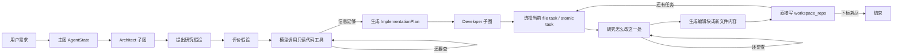
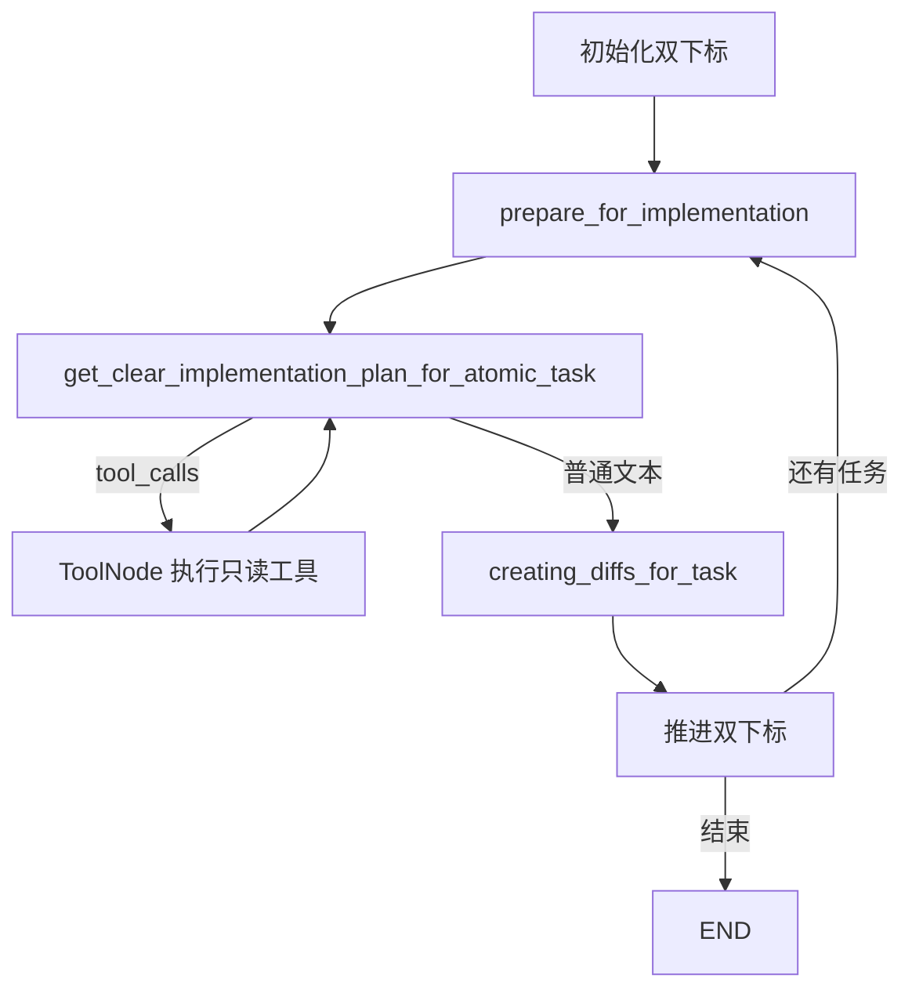

# SWE Agent 完整项目导读

> 分析对象：[langtalks/swe-agent@5946af4](https://github.com/langtalks/swe-agent/tree/5946af4f57cba03761015837ad5f87ef5c8d99e9)
> 本地源码：`D:\learn\project\项目一SWE\swe-agent-main`
> 核查日期：2026-09-08

## 0. 先给出一句话结论

这是一个**让 Claude 先研究并规划代码修改，再按计划直接修改本地仓库文件**的实验性 Python Agent。它用 LangGraph 把流程拆成 Architect 和 Developer 两个顺序子图，用 Pydantic 传递结构化计划，用 Tree-sitter/关键词检索读取目标代码，最后用模型生成的行号编辑块改写文件。

最重要的理解是：它是一个**最小原型**，不是完整的生产级 SWE Agent。规划与工具循环已经搭出来了，但安全编辑、测试验收、失败恢复、沙箱、持久化和真正的多语言检索都还没有闭环。并且截至核查日期，源码硬编码的 Claude Sonnet 4 型号已经退役，所以当前版本不修改模型配置就不能完成首次模型调用。README 自己也标注了 Alpha；阅读源码时必须把“已经实现”“框架理论上支持”“README 宣传或 Roadmap”三者分开。

## 1. 项目身份与边界

- GitHub 仓库当前名称是 `langtalks/swe-agent`；README 中仍出现旧克隆地址 `langtalks/swe-agent-langgraph`，属于文档残留。
- 它不是 Princeton 的 `SWE-agent` 官方项目，只是同类、同名方向的 LangTalks 项目。
- 最新固定提交为 `5946af4f57cba03761015837ad5f87ef5c8d99e9`，本地 README 的 Git blob SHA 与 GitHub 返回值一致。
- 许可证是 MIT，可以学习、修改和再发布，但保留许可证与版权声明仍是基本要求。
- 项目本身不包含要被修改的业务仓库。运行前要把目标仓库克隆到项目根目录的 `./workspace_repo`。
- 项目没有 Web 前端。交互入口是 LangGraph 开发服务器/Studio；真正产物是 `workspace_repo` 中被改写的文件，而不是一段面向用户的聊天回复。

## 2. 最好用的整体心智模型



这条链里没有“测试是否通过”的节点，也没有“失败后修复”的节点。因此源码中的“完成”只表示：**计划里的双层任务下标已经走到末尾**。它不等于代码能运行，更不等于需求已经正确完成。

## 3. 目录和每个文件的职责

### 3.1 根目录

| 文件/目录 | 真实职责 |
|---|---|
| `README.md` | 项目定位、架构图、启动说明和 Roadmap；部分能力描述超前于源码。 |
| `CONTRIBUTING.md` | 贡献指南；提到 pytest、Black、mypy 等，但当前仓库没有相应测试目录或开发依赖配置。 |
| `pyproject.toml` | 声明 Python 3.12+、项目元数据和直接依赖。description 仍是占位文本。 |
| `uv.lock` | 锁定完整依赖图，使同一份环境更容易复现。 |
| `.python-version` | 指定 Python 3.12。 |
| `.env.example` | Anthropic Key 与 LangSmith tracing 变量模板。 |
| `.gitignore` | 忽略虚拟环境、环境变量、缓存、日志以及整个 `workspace_repo/`。 |
| `langgraph.json` | 向 LangGraph CLI 注册三个图：总图 `agent`、调试用 `architect`、调试用 `developer`。 |
| `langgraph_debug.py` | 暴露两个子图，并允许直接调用 `dev()` 启动开发模式。 |
| `LICENSE` | MIT 许可证。 |
| `static/` | README 使用的封面、流程图、输入输出截图，不参与运行。 |
| `scripts/setup.py` | 从真实 `.env` 生成去值后的 `.env.example`；旧的 Pipenv 转 requirements 逻辑已停用。 |

### 3.2 `agent/` 运行代码

| 文件 | 真实职责 |
|---|---|
| `agent/graph.py` | 顶层编排：START → Architect → Developer → END。 |
| `agent/common/entities.py` | Architect 与 Developer 之间的计划数据契约。 |
| `agent/architect/state.py` | Architect 的研究假设、研究历史、合法性标记与最终计划。 |
| `agent/architect/graph.py` | Architect 的模型、工具循环、路由和计划提取。 |
| `agent/architect/prompts/*.md` | 研究下一步、评价研究方向、执行研究、提取计划四类提示词。 |
| `agent/developer/state.py` | Developer 的任务下标、当前文件、研究消息和 diff 状态。 |
| `agent/developer/graph.py` | Developer 的双层任务循环、工具研究、编辑文本解析与文件写入。 |
| `agent/developer/prompts/*.md` | 原子任务研究、旧文件编辑块生成、新文件生成等提示词。 |
| `agent/tools/search.py` | 递归搜索 Python 文件中的字面关键词。 |
| `agent/tools/codemap.py` | 用 Tree-sitter 提取定义、函数实现或读取完整非代码文件。 |
| `agent/tools/write.py` | Gitingest 目录树生成，以及两个当前未接入主图的写文件工具。 |

### 3.3 辅助和遗留代码

| 文件 | 状态 |
|---|---|
| `helpers/prompts.py` | 正在使用；负责把自定义 Markdown 提示词解析为 LangChain Prompt。 |
| `helpers/tools.py` | 未使用；把工具名和描述拼成字符串。 |
| `agent/state.py` | 未使用；早期通用 `scratchpad/messages` 状态。 |
| `agent/prompts.py` | 未使用；早期 Think/Act Prompt，而且导入了当前不存在的 `agent.tools.tool_descriptions`。 |
| `developer/prompts/developing_prompt.md` | 未加载。 |
| `developer/prompts/implement_diff.md` | 被加载为 runnable，但这个 runnable 从未调用。 |

## 4. 技术栈：每一项到底做什么

版本以 [`uv.lock`](https://github.com/langtalks/swe-agent/blob/5946af4f57cba03761015837ad5f87ef5c8d99e9/uv.lock) 为准，而不是只看 `pyproject.toml` 的宽松下限。

| 技术 | 锁定版本 | 在本项目中的实际用途 | 需要看清的边界 |
|---|---:|---|---|
| Python | 3.12+ | 所有 Agent、工具、状态和脚本的实现语言。 | 源码大量同步文件 I/O 和同步模型调用，不是异步实现。 |
| uv | 锁文件格式对应当前环境 | 安装依赖、创建 `.venv`、按锁文件复现环境。 | 它只管理环境，不负责 Agent 编排。 |
| LangGraph | 0.6.3 | `StateGraph`、START/END、节点、普通边、条件边、消息 reducer、嵌套子图。 | 源码没有显式 checkpointer；“LangGraph 支持恢复”不代表这个图已经配置恢复。 |
| langgraph-cli[inmem] | 0.3.6 | 读取 `langgraph.json`、启动本地开发服务/Studio、提供内存开发运行时。 | `inmem` 更适合开发，不等于生产持久化。 |
| langchain-core | 0.3.72 | 消息类型、Prompt Template、Output Parser、`@tool`、ToolNode 所需工具协议。 | 源码直接导入它，却没有在 `pyproject.toml` 中直接声明，而是依赖传递依赖。 |
| langchain-anthropic | 0.3.5 | `ChatAnthropic` 模型适配器；所有推理节点都固定使用 Claude。 | 没有模型工厂、运行时配置或替代供应商 seam。 |
| Claude Sonnet 4 | `claude-sonnet-4-20250514` | 提研究假设、评价假设、决定工具调用、生成计划、生成编辑内容。 | 型号硬编码在模块导入期；Anthropic 已于 2026-06-15 将其退役，请求会失败，官方建议迁移到 `claude-sonnet-4-6`。 |
| Pydantic | 2.10.6 | 校验图状态、研究步骤和 `ImplementationPlan`。 | 同样被直接导入但未直接声明；只校验结构，不校验计划是否业务正确。 |
| Gitingest | 0.1.2 | 扫描 `workspace_repo`，取得目录树给模型看。 | `ingest()` 同时计算 summary/tree/content，源码只用 tree，可能做了多余工作；且多个节点重复扫描。 |
| Tree-sitter | 0.21.3 | 将源码解析成语法树。 | 解析器只是底座，是否支持某语言取决于 query 是否按该语言语法编写。 |
| tree-sitter-languages | 1.10.2 | 提供 Python/JS/TS 等预编译 grammar 与 parser。 | 当前 query 使用 Python 的 `class_definition/function_definition/block` 节点；仅做扩展名映射并不能让 JS/TS 正常工作。 |
| LangSmith | 0.4.11 | 配合 `LANGCHAIN_TRACING_V2`、API key、project 记录模型链路。 | 业务源码没有直接调用；是否生效取决于环境变量。 |
| diff-match-patch | 20241021 | 源码创建了 `dmp = diff_match_patch()`。 | 之后没有任何调用，当前编辑算法实际上不是 diff-match-patch。 |
| thefuzz | 0.22.1 | 无实际引用。 | 属于未使用依赖。 |
| fuzzysearch | 0.7.3 | 无实际引用。 | 属于未使用依赖。 |
| Git | 外部工具 | 用户手动克隆目标仓库；Agent 修改工作区后可自行查看 diff。 | Agent 本身不创建分支、不提交、不回滚，也没有 Git 工具。 |

### 为什么同时需要 LangGraph、LangChain 和 Pydantic

- **LangGraph**解决“流程怎么走”：哪些节点先后执行、何时循环、何时结束。
- **LangChain Core**解决“节点里面怎么跟模型和工具说话”：消息、Prompt、工具调用、输出解析。
- **Pydantic**解决“跨节点传什么结构”：字段、类型和模型输出结构校验。

三者不是重复关系。可以把 LangGraph 看成流程引擎，LangChain 看成模型/工具协议层，Pydantic 看成运行时数据契约。

## 5. 如何启动与配置

> 当前运行阻塞：[`claude-sonnet-4-20250514` 已退役](https://platform.claude.com/docs/en/about-claude/model-deprecations)。下面是原项目的环境与入口说明；实际运行前必须先把硬编码型号改为可用模型并重新做 Prompt/结构化输出回归测试，不能只机械替换后就假定行为完全一致。

### 5.1 准备过程

1. 安装 Python 3.12 和 uv。
2. 在项目根目录执行 `uv sync`。
3. 把 `.env.example` 复制成 `.env`，至少填写 `ANTHROPIC_API_KEY`。
4. 把一个待修改仓库克隆成 `./workspace_repo`。
5. 在项目根目录执行 `langgraph dev` 或 `uv run langgraph dev`。
6. 在 LangGraph Studio/API 中调用 `agent` 图，并给 `implementation_research_scratchpad` 放入用户需求消息。

必须从项目根目录运行，因为源码多处硬编码相对路径 `./workspace_repo`。[`langgraph.json`](https://github.com/langtalks/swe-agent/blob/5946af4f57cba03761015837ad5f87ef5c8d99e9/langgraph.json) 指定读取 `.env`；README Quick Start 一处写 `.env.local`，与真实配置不一致，应以 `langgraph.json` 为准。

### 5.2 三个可调试图

```json
{
  "agent": "./agent/graph.py:swe_agent",
  "architect": "./langgraph_debug.py:swe_architect",
  "developer": "./langgraph_debug.py:swe_developer"
}
```

- `agent`：完整端到端流程。
- `architect`：只看研究和计划，适合调 Prompt/工具调用。
- `developer`：给定 `ImplementationPlan` 后只看执行，适合调编辑循环。

这是一项不错的可调试性设计：子图既能嵌入总图，也能单独运行。但 Developer 仍直接写文件，因此单独调试它时也要准备隔离的目标仓库。

## 6. 状态与数据结构：Agent 的“内存”是什么

### 6.1 顶层 `AgentState`

[`agent/graph.py`](https://github.com/langtalks/swe-agent/blob/5946af4f57cba03761015837ad5f87ef5c8d99e9/agent/graph.py#L9-L27) 只有两个核心字段：

```python
class AgentState(BaseModel):
    implementation_research_scratchpad: Annotated[list[AnyMessage], add_messages]
    implementation_plan: Optional[ImplementationPlan] = None
```

- `implementation_research_scratchpad`：初始用户需求，以及按 reducer 合并的消息列表。
- `implementation_plan`：Architect 产出的结构化修改计划。
- `add_messages`：LangGraph reducer。节点返回新消息时，不是覆盖整列，而是按消息 ID 合并/追加。

顶层状态没有最终回答、执行结果、错误列表、测试结果、成本、补丁或变更文件清单。因此最终图状态对审计并不充分。

### 6.2 计划契约

[`agent/common/entities.py`](https://github.com/langtalks/swe-agent/blob/5946af4f57cba03761015837ad5f87ef5c8d99e9/agent/common/entities.py) 定义三层结构：

```text
ImplementationPlan
└── tasks: list[ImplementationTask]
    ├── file_path
    ├── logical_task
    └── atomic_tasks: list[AtomicTask]
        ├── atomic_task
        └── additional_context
```

- `ImplementationTask` 是**文件级任务**：一个 task 只指向一个 `file_path`。
- `logical_task` 说明为什么改这个文件。
- `AtomicTask` 是该文件内的一次具体修改意图。
- `additional_context` 携带 Architect 研究所得的背景。

示意：

```json
{
  "tasks": [
    {
      "file_path": "./workspace_repo/auth/service.py",
      "logical_task": "为登录流程增加失败次数限制",
      "atomic_tasks": [
        {
          "atomic_task": "在 authenticate 中记录连续失败次数",
          "additional_context": "用户模型已有 failed_attempts 字段"
        },
        {
          "atomic_task": "达到阈值时拒绝登录",
          "additional_context": "沿用项目现有 DomainError"
        }
      ]
    }
  ]
}
```

它的优点是简单、易序列化、易让模型生成。缺点是没有 `task_id`、依赖关系、前置条件、验收条件、预期符号、文件哈希和失败策略。“atomic task”只是计划粒度，不是数据库意义或文件系统意义上的原子事务。

### 6.3 Architect 状态

- `research_next_step`：下一条研究假设文本。
- `implementation_research_scratchpad`：用户需求、模型思考、工具调用和工具结果。
- `is_valid_research_step`：评价模型给出的布尔值。
- `implementation_plan`：最终计划。

Architect 显式限制输入只要 scratchpad，输出只要 plan。这让内部研究细节不会完整泄漏到总图输出，但也意味着上层没有完整的证据链。

### 6.4 Developer 状态

- `current_task_idx`：当前文件级任务下标。
- `current_atomic_task_idx`：当前文件内原子任务下标。
- `current_file_content`：准备阶段读到的文件内容，或字符串 `This is a new file`。
- `codebase_structure`：Gitingest 生成的目录树。
- `atomic_implementation_research`：当前原子任务的模型/工具消息。
- `diffs`：声明了字段，但真实执行路径没有把解析结果写进它。

`atomic_implementation_research` 使用自定义 reducer：右侧更新为 `None` 或空列表时，直接清空历史；否则使用 `add_messages`。因此每个原子任务开始前会丢弃上一个原子任务的研究轨迹，避免无限累积，但也丢掉可能有用的局部上下文。

## 7. 顶层图：为什么它只是顺序编排

核心代码可以压缩成：

```python
graph.add_edge(START, "swe_architect")
graph.add_edge("swe_architect", "swe_developer")
graph.add_edge("swe_developer", END)
```

没有条件分支，没有“计划为空就停止”，没有人工审批，也没有 Developer 失败后回到 Architect。`recursion_limit=200` 只是限制图最多推进多少步，防止无限循环；它不是 token 预算、费用预算或成功保证。

从模块设计看，顶层图的 interface 很小，背后组合两个子图，属于相对深的模块：调用者只需要给初始状态，不必知道子图节点。但这个 interface 缺少运行配置和结果契约，导致模型、工作区和完成语义藏在全局硬编码里，调用者无法安全控制。

## 8. Architect 子图：研究并生成计划

### 8.1 四个模型角色

[`agent/architect/graph.py`](https://github.com/langtalks/swe-agent/blob/5946af4f57cba03761015837ad5f87ef5c8d99e9/agent/architect/graph.py#L20-L41) 在模块导入时构造四条 runnable：

1. `plan_next_step_runnable`：输出 `ResearchStep(reasoning, hypothesis)`。
2. `check_research_runnable`：输出 `ResearchEvaluation(reasoning, is_valid)`。
3. `conduct_research_runnable`：绑定搜索和 codemap 工具，决定调用哪个工具或直接给研究结论。
4. `extract_implementation_runnable`：把研究历史转成 JSON 计划。

最短情况下，Architect 至少需要四次模型调用：提出假设、评价假设、执行研究、提取计划。只要研究模型发出工具调用，就会“工具执行 → 再问研究模型”，调用次数继续增加。

### 8.2 节点逐步解释

#### `come_up_with_research_next_step`

- 扫描 `workspace_repo` 目录树。
- 把目录树和现有研究历史送给 Claude。
- 得到 `hypothesis` 与 `reasoning`。
- 将它们重新包装成 `AIMessage` 追加到研究历史。

注意：结构化输出中的 `reasoning` 并没有作为独立状态保存，只被拼入自然语言消息。

#### `check_research_step`

- 另一次 Claude 调用检查这个方向是否重复、是否与用户任务相关。
- 有效时写入一条 HumanMessage：“可以开始研究”。
- 无效时同样写入 HumanMessage，说明拒绝原因。

把模型评价伪装成 HumanMessage 能影响后续模型，但会模糊“这句话到底来自用户还是另一个模型”。更严谨的轨迹应保存角色来源元数据。

#### `conduct_research`

- 再次取得目录树。
- 让 Claude 根据假设决定是否调用工具。
- 返回的 AIMessage 如果有 `tool_calls`，条件路由进入 `ToolNode`。
- ToolNode 执行只读搜索/codemap 工具，把 ToolMessage 追加回 scratchpad，然后再次进入 `conduct_research`。
- 当 Claude 返回普通文本、没有 tool call 时，进入计划提取。

这就是典型 ReAct 式工具循环：模型不是自己读取磁盘，而是输出结构化工具调用；LangGraph 执行工具后把结果喂回模型。

#### `extract_implementation_plan`

- 把工具消息转换为更普通的 AI/Human 对话。
- 再次扫描目录树。
- 用 `JsonOutputParser` 给模型格式说明。
- 模型返回 JSON 后，再执行 `ImplementationPlan(**response)` 做 Pydantic 校验。

这里做了双层约束：Prompt 要求 JSON，Pydantic 再检查字段结构。但它只能发现“字段缺失或类型不对”，不能发现路径不存在、任务顺序错误或需求理解错。

### 8.3 Architect Prompt 的分工

| Prompt | 目标 |
|---|---|
| `plan_next_step_prompt.md` | 根据历史与目录树决定下一条研究假设。 |
| `check_research_already_explored.md` | 防止重复研究或跑偏。 |
| `conduct_research_plan_prompt.md` | 把假设拆成调查点，调用工具并综合发现。 |
| `extract_implementation_plan.md` | 把研究结果拆成最少文件修改和原子任务，路径必须以 `./workspace_repo/` 开头。 |

Prompt 全部以 Markdown 保存，优点是便于非代码审阅；缺点是没有版本号、自动测试和输出样例回归。

### 8.4 Architect 的核心路由缺陷

源码同时配置了：

```python
workflow.add_conditional_edges("check_research_step", should_conduct_research, ...)
workflow.add_edge("check_research_step", "conduct_research")
```

也就是“根据有效性选择下一步”之后，又无条件直连研究节点。固定版本 LangGraph 会分别注册普通边和条件分支，普通边不会被条件边替代。因此无效假设不能被可靠阻断；它可能一边回去重新规划，一边仍进入研究。这不是设计意图，而是图连边错误。

另外，`call_model()` 没有注册成节点，参数名还与当前 Prompt 不一致，属于遗留死代码。

## 9. Developer 子图：逐个原子任务改文件

### 9.1 双层下标循环

Developer 不是一次把所有计划丢给模型，而是维护：

```text
tasks[current_task_idx]
└── atomic_tasks[current_atomic_task_idx]
```

每执行完一个原子任务：

- 若同一文件还有 atomic task，只增加 `current_atomic_task_idx`。
- 若该文件已完成，增加 `current_task_idx`，并把 atomic 下标归零。
- 当 `current_task_idx >= len(plan.tasks)` 时结束。

这个控制流清晰，是项目最值得保留的部分之一：它降低了单次模型需要处理的修改范围。不过，“执行完”目前只指写入节点返回，并不检查文件是否真的变对。

### 9.2 每个原子任务的实际步骤



#### 准备阶段

- 取当前 `ImplementationTask` 和目标路径。
- 直接 `open(file_path)` 读取；文件不存在就把内容标记为新文件。
- 再次用 Gitingest 扫描整个 `workspace_repo`。
- 把上个原子任务的研究消息清空。

如果计划是 `tasks=[]`，这里在完成判断之前访问 `tasks[0]`，会直接抛出 `IndexError`。仓库已有隔离复现证据。

#### 原子任务研究阶段

模型收到：当前任务、目标文件、当前文件内容、全项目目录树、Architect 附加背景、本轮已有研究消息。它可以循环调用关键词搜索与 codemap，直到认为信息足够，再输出自然语言实现计划。

Prompt 强调只能修改当前 `target_file`，这是一条模型指令，不是文件系统强制约束。真正写入仍完全信任 `file_path`。

#### 编辑阶段：新文件

如果目标不存在：

1. 把任务、附加背景和研究历史交给 `implement_new_file` Prompt。
2. Claude 返回字符串。
3. `open(file_path, "w")` 直接写入完整字符串。

这里没有剥离 Markdown 代码围栏，没有创建父目录，没有校验语法，也没有检查路径是否仍位于 `workspace_repo`。如果模型输出带语言标记的 Markdown 围栏，围栏本身也可能被写进源码。

#### 编辑阶段：已有文件

[`creating_diffs_for_task`](https://github.com/langtalks/swe-agent/blob/5946af4f57cba03761015837ad5f87ef5c8d99e9/agent/developer/graph.py#L127-L191) 是全项目最核心、风险也最高的函数：

1. 重新读目标文件。
2. 给每行加上 `1| `、`2| ` 形式的行号。
3. 让 Claude 输出一个或多个 `<code_change_request>` 块。
4. 用正则提取 `original_code_snippet` 和 `edit_code_snippet`。
5. 只从 original snippet 的首末行解析行号。
6. 用 Python list slicing 替换这段行区间。
7. 立即覆盖原文件。

核心替换可以抽象成：

```python
new_content = (
    current_lines[:first_line - 1]
    + edited_code.splitlines()
    + current_lines[last_line:]
)
```

关键不是这段切片本身，而是它**完全没有比较 original snippet 的实际文本**。`original_code_snippet` 看似是乐观锁，实际上只被当作行号容器。

这里还有一层“看似结构化、实际未生效”的细节：代码把 `JsonOutputParser(pydantic_object=Diffs).get_format_instructions()` 作为 `output_format` 传给 Prompt，但 `create_diff_prompt.md` 既没有声明也没有使用这个变量；模型输出最终也没有经过 `Diffs` 校验，而是完全由正则解析。`DiffTask` 声明的第二个字段叫 `task_description`，Prompt 协议却叫 `edit_code_snippet`，两套契约已经脱节。

### 9.3 为什么多块编辑会错位

假设原文件：

```text
1 A
2 B
3 C
4 D
```

模型一次返回两个块：第一个在第 1 行后插入新行，第二个把原第 4 行 D 改掉。第一块应用后，D 已移动到第 5 行；第二块仍按旧行号 4 操作，于是错误修改当前第 4 行 C。这一行为已经用固定模型响应和临时文件隔离复现。

其他问题：

- original 文本与磁盘内容不一致仍会覆盖。
- 一个可解析块都没有时函数不报错，图仍推进任务下标。
- 多块每次都重新读文件，但行号基于最初那份带行号内容。
- 写入会统一换行并丢失原文件末尾换行信息。
- 读写未指定 UTF-8；Windows 默认编码可能与目标文件编码不同。
- 没有临时文件、原子替换、备份、文件哈希或并发修改检测。
- 没有把编辑结果返回状态，所以后续节点无法区分 applied/noop/rejected。

### 9.4 最短模型调用成本

如果 Architect 一轮研究就结束，且计划只有一个原子任务：

- Architect 最少 4 次模型调用。
- Developer 最少 2 次：一次决定如何实现，一次生成新文件或编辑块。
- 总计至少 6 次模型调用。

每次工具循环都会增加模型调用；目录树也会被多次重新生成。项目没有 max token、max cost、max tool output 或每阶段超时配置，只有图级 recursion limit。

## 10. 三类工具逐个讲

### 10.1 关键词搜索 `search.py`

真正暴露给模型的只有 `search_keyword_in_directory`：

- 递归 `os.walk(directory)`。
- 只搜索 `.py` 文件。
- 对 search term 做 `re.escape`，所以是字面量而非正则。
- 使用 `re.IGNORECASE`，大小写不敏感。
- 默认返回命中行前后各 2 行。
- 返回绝对路径、命中行号和片段。

README 所说“semantic search”与实现不符：这里没有 embedding、向量库、符号引用图或相关性排序。Docstring 说搜索词至少 3 个字符，但代码没有强制检查；结果也没有条数/字节上限，大仓库里可能产生很长上下文。

### 10.2 代码结构 `codemap.py`

暴露四个工具：

1. `get_code_definitions(file_path)`：输出类、方法、函数签名与行号。
2. `get_function_implementation(file_path, function_name)`：抽取指定函数/方法实现。
3. `get_code_definitions_multi(file_paths)`：批量执行定义提取。
4. `get_raw_file_content(file_path)`：读取完整 UTF-8 文件。

Tree-sitter 的价值是按语法树定位符号，比纯正则更懂代码结构。但当前 query 只写了 Python 节点名：`class_definition`、`function_definition`、`parameters`、`block`。JavaScript/TypeScript grammar 使用不同节点，因此 `lang_map` 中列出 js/jsx/ts/tsx 不代表查询可用。项目 Roadmap 仍把 Multi-Language Support 列为未来功能，这与源码现实一致。

工具也没有路径隔离：只要模型给出可读路径，`get_raw_file_content` 就会读取。安全系统不能只靠 Prompt 要求路径前缀。

### 10.3 文件结构与写工具 `write.py`

`get_files_structure` 调用：

```python
summary, tree, content = ingest(directory)
return tree
```

它只返回 tree，却让 Gitingest 完成完整 ingest。Architect 的提假设、执行研究、提取计划，以及 Developer 每个原子任务准备阶段都会重新调用，可能对大仓库重复消耗 I/O 与 CPU。

另外两个工具 `create_file`、`write_to_file` 放进了 `write_tools`，但 Architect/Developer 的 ToolNode 都只绑定 search + codemap，因此模型根本不会调用它们。实际写入由 Developer 节点直接 `open()` 完成。

`create_file` 的 docstring 说文件已存在应报错，代码却直接以 `w` 打开并覆盖；顶层文件路径没有目录名时，`os.makedirs("")` 也会报错。这些缺陷当前因工具未接入而没有进入主链，但仍说明接口与实现已经漂移。

## 11. Markdown Prompt 加载器如何工作

`helpers/prompts.py` 允许 Prompt 文件写成：

```markdown
_type: "chat"
- input_variables:
  - codebase_structure

# System
...

# Human
{codebase_structure}
```

加载过程：

1. 正则提取 `input_variables`。
2. 从第一个 Markdown 标题开始截掉元数据。
3. 找出正文所有 `{variable}`。
4. 双向校验：正文变量都必须声明，声明变量都必须被使用。
5. 若 `_type` 是 `chat`，按 `# System`、`# Human`、`# Placeholder` 等标题拆成消息对。
6. 构造 `ChatPromptTemplate`；否则构造普通 `PromptTemplate`。

它把 Prompt 从 Python 代码中分离出来，提升可读性和编辑便利性，是一个合理 seam。但实现依赖较脆弱的正则语法：变量名只接受 `\w+`，标题格式必须严格，文件读取没指定 encoding，也没有针对解析器的测试。

## 12. 用一个真实需求走完整条链

假设用户说：“给现有登录接口增加连续失败 5 次后锁定 15 分钟的功能。”

1. **输入总图**：这句话作为 HumanMessage 进入 `implementation_research_scratchpad`。
2. **Architect 提假设**：例如“先找到登录入口、用户模型和现有异常模式”。
3. **评价假设**：另一个模型调用判断是否有用、是否重复。
4. **研究**：模型可能调用关键词工具搜 `login`、用 codemap 读 `authenticate`、用 raw content 看配置。
5. **结束研究**：当模型不再发 tool call，而是返回总结时，研究循环结束。
6. **提取计划**：模型生成 `ImplementationPlan`，可能包含用户模型、认证逻辑、配置、测试等文件任务。
7. **Developer 取第一个原子任务**：读取目标文件并研究相关符号。
8. **生成编辑块**：模型给出带旧行号的替换请求，节点直接覆盖文件。
9. **推进下标**：继续该文件下一个 atomic task，再进入下一个文件。
10. **结束**：所有下标走完即 END。

这里不会自动运行项目已有测试，也不会验证“5 次”“15 分钟”“并发登录”“时间回拨”等业务条件。即使某个编辑块没解析出来，原逻辑也可能继续走到 END。因此要把它理解为“自动产生并应用候选改动”，而不是“自动证明功能完成”。

## 13. README 描述与源码事实对照

| README/文档说法 | 源码事实 |
|---|---|
| Multi-Agent Workflow | 有两个顺序 LangGraph 子图；都使用同一 Claude 型号，没有并行协商或互审。 |
| Semantic Search | 实际是 Python 字面关键词搜索 + Tree-sitter 局部结构提取。 |
| Precise/Atomic Modification | 计划粒度较细，但写文件不是事务，旧文本不匹配也能覆盖。 |
| Validates changes | 没有测试、构建、lint 或业务验收节点。 |
| Resumability | 状态结构理论上可配 checkpoint，但源码 compile 时没有传 checkpointer。 |
| Multi-Language Support | Roadmap 项；当前 query 实质是 Python 专用。 |
| Running Tests | README 给了 pytest 命令，但仓库没有 tests/，pyproject 也未声明 pytest/coverage。 |
| Code Quality Checks | CONTRIBUTING 提到 Black/isort/mypy/flake8，但当前配置未声明这些工具。 |

这不代表项目“毫无价值”。它有清晰原型骨架，只是文档混合了愿景和现实。学习开源项目时，最关键能力就是用 import、节点、边和测试证据判断真实能力。

## 14. 架构评价：哪些模块深，哪些 seam 有问题

### 值得肯定

- **主图 interface 小**：调用者不必知道 Architect/Developer 内部节点。
- **计划是明确的数据契约**：比把一大段自然语言直接交给 Developer 更稳定。
- **按原子任务限制上下文**：让每轮模型关注单个文件、单个变化。
- **Prompt 外置**：便于单独迭代和审阅。
- **只读研究工具和写入阶段分开**：模型研究时没有直接写工具，降低了误写机会。
- **子图可单独调试**：便于定位规划问题还是执行问题。

### 最关键的浅模块/坏 seam

`creating_diffs_for_task` 同时做模型调用、协议解析、旧文件定位、变更应用和持久化。它的 interface 没有显式返回值，所有复杂度都以文件副作用和静默失败泄露给调用者，是当前最需要拆分的地方。

更合理的 seam 应是：

```text
LLM 生成 EditProposal
        ↓
纯函数解析/校验 Proposal
        ↓
Workspace adapter 预检路径、哈希和唯一匹配
        ↓
原子应用并返回 EditResult
        ↓
Verification 执行确定性检查
```

这样调用者只需要理解 `EditProposal` 与 `EditResult`，复杂的编码、换行、路径、冲突和写入细节留在模块内部，模块才有足够 Depth、Leverage 和 Locality。

## 15. 已确认的问题清单

### P0：会直接造成错误改动或假成功

1. 硬编码模型已经退役，当前版本会在模型调用处失败。
2. Architect 条件边和普通边重复，研究合法性判断无法可靠阻断。
3. 现有文件编辑不比较 original text，只相信模型行号。
4. 同一响应多块编辑可能因前一块改变行数而错位。
5. 没有解析到任何编辑块时静默推进。
6. 空计划先访问 `tasks[0]`，抛 `IndexError`。
7. 下标耗尽即成功，没有任何测试/构建验收。
8. 路径直接来自模型，没有工作区根目录约束，可读写范围过宽。

### P1：高概率影响可用性和可维护性

1. 新文件分支不创建父目录。
2. 新文件可能把 Markdown 围栏一并写入。
3. 文件读写使用平台默认编码，可能损坏 UTF-8 或其他编码文件。
4. 写入规范化换行且可能丢末尾换行。
5. 工具输出与 Gitingest 没有限额/缓存，成本不可控。
6. 多 tool call 转换时只记录 `tool_calls[0]`，会丢其他调用描述和 call ID 关系。
7. 模型、工作区、预算都硬编码，测试很难注入 fake adapter。
8. 没有 checkpoint、操作日志、补丁 artifact、回滚或崩溃恢复对账。

### P2：工程卫生和文档一致性

1. 多个 Prompt、状态、helper、runnable 和依赖未使用。
2. `create_file` 的 docstring 与覆盖实现相反。
3. `pyproject` 未直接声明源码直接 import 的 `pydantic` 与 `langchain-core`。
4. `Diffs/DiffTask` 数据模型、Prompt 输出格式和真实正则解析互相脱节。
5. 测试、格式化、类型检查命令写在文档中，但仓库没有对应配置。
6. 项目描述仍是 `Add your description here`。

## 16. 如果你要读懂源码，推荐顺序

1. `agent/common/entities.py`：先理解计划长什么样。
2. `agent/graph.py`：只看总流程。
3. `agent/architect/state.py` 与 `architect/graph.py`：沿每条边画出研究循环。
4. 四个 Architect Prompt：看模型每一步被要求做什么。
5. `agent/developer/state.py`：理解双下标和消息清空 reducer。
6. `developer/graph.py`：重点读 `prepare_for_implementation`、`creating_diffs_for_task`、`proceed_to_next_atomic_task`。
7. Developer Prompt：把模型输出协议与正则解析对上。
8. `tools/search.py`、`tools/codemap.py`、`tools/write.py`：确认模型到底能看到什么。
9. `helpers/prompts.py`：最后看 Prompt 是怎样被加载的。
10. `langgraph.json`、`.env.example`、`uv.lock`：补齐运行与版本知识。

不要先啃 README 的所有概念再找代码。先抓住“状态—节点—边—副作用”四件事，整个项目会迅速变清楚。

## 17. 调试时应该观察什么

- Architect 是否在无效假设后仍进入 conduct 节点。
- 每次 `conduct_research` 是发 tool call 还是普通文本；普通文本会结束研究。
- 计划 JSON 是否包含完整 `./workspace_repo/` 路径。
- Developer 当前两个下标分别是多少。
- `atomic_implementation_research` 是否在每个任务开始时被清空。
- 模型输出有没有严格匹配 `<code_change_request>` 格式。
- 同一个响应是否产生多个会改变行数的块。
- 文件写入前后编码、换行和末尾换行是否变化。
- 结束时只有下标完成，还是有外部测试证据。

如果要实验，务必使用临时仓库或 Git worktree，并在每次运行后检查 `git diff`。当前实现不应直接对重要、未备份的工作区运行。

## 18. 对这个项目最准确的能力描述

可以说：

> 基于 LangGraph 构建的两阶段代码修改 Agent 原型。Architect 通过 Claude 与只读代码工具迭代研究，生成 Pydantic 结构化实施计划；Developer 按文件和原子任务循环研究并应用模型生成的文本编辑。

暂时不要说：

- “已经实现可靠语义检索”；
- “支持多语言代码理解”；
- “能自动验证业务正确性”；
- “所有修改都是原子和安全的”；
- “可从任意中断可靠恢复”；
- “达到生产级 SWE-bench 能力”。

## 19. 最后的核心总结

这个项目的学习价值不在于代码量，而在于它展示了一个 Agent 原型的完整骨架：**结构化状态、嵌套状态图、模型工具循环、规划/执行分工、Prompt 工程和文件副作用**。真正的工程挑战则集中在它尚未完成的最后一公里：**模型输出如何变成可验证、可拒绝、可恢复的代码变更，以及如何用测试结果而不是任务下标定义成功**。

如果只记住三件事：

1. Architect 负责“查什么、为什么查、最后改哪些文件”；Developer 负责“当前这一小步怎样改并落盘”。
2. Pydantic 只保证数据形状，LangGraph 只保证流程推进；二者都不会自动保证代码正确。
3. 全项目最核心的风险点是 `creating_diffs_for_task`：它把不可靠的模型文本直接变成了不可审计的文件覆盖。

## 参考源码

- [顶层图](https://github.com/langtalks/swe-agent/blob/5946af4f57cba03761015837ad5f87ef5c8d99e9/agent/graph.py)
- [Architect 图](https://github.com/langtalks/swe-agent/blob/5946af4f57cba03761015837ad5f87ef5c8d99e9/agent/architect/graph.py)
- [Developer 图](https://github.com/langtalks/swe-agent/blob/5946af4f57cba03761015837ad5f87ef5c8d99e9/agent/developer/graph.py)
- [计划实体](https://github.com/langtalks/swe-agent/blob/5946af4f57cba03761015837ad5f87ef5c8d99e9/agent/common/entities.py)
- [关键词搜索](https://github.com/langtalks/swe-agent/blob/5946af4f57cba03761015837ad5f87ef5c8d99e9/agent/tools/search.py)
- [Tree-sitter codemap](https://github.com/langtalks/swe-agent/blob/5946af4f57cba03761015837ad5f87ef5c8d99e9/agent/tools/codemap.py)
- [文件工具](https://github.com/langtalks/swe-agent/blob/5946af4f57cba03761015837ad5f87ef5c8d99e9/agent/tools/write.py)
- [Prompt 加载器](https://github.com/langtalks/swe-agent/blob/5946af4f57cba03761015837ad5f87ef5c8d99e9/helpers/prompts.py)
- [运行配置](https://github.com/langtalks/swe-agent/blob/5946af4f57cba03761015837ad5f87ef5c8d99e9/langgraph.json)
- [依赖配置](https://github.com/langtalks/swe-agent/blob/5946af4f57cba03761015837ad5f87ef5c8d99e9/pyproject.toml)
